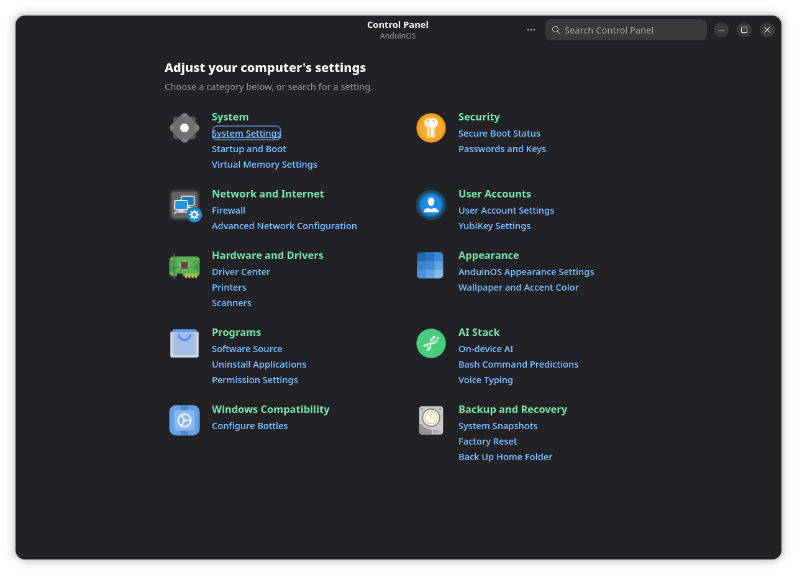
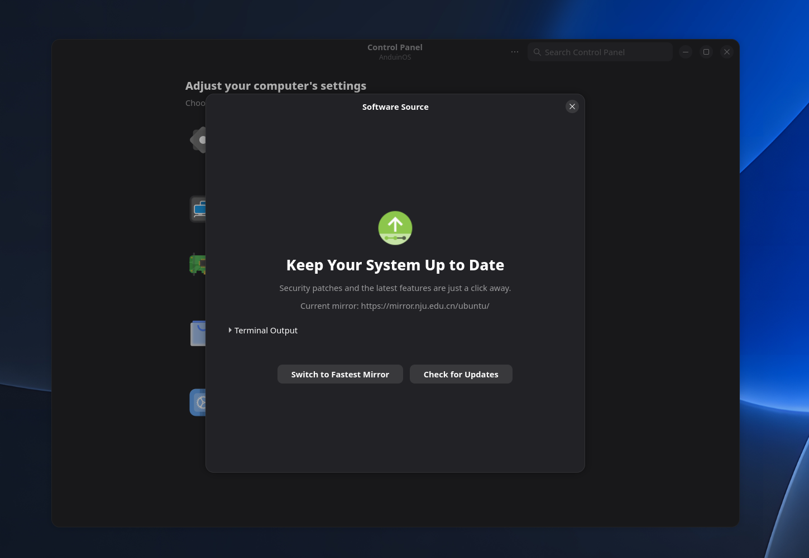

# AnduinOS Control Panel

Control Panel brings system settings, AnduinOS tools, and recovery options into one searchable window. Open **Control Panel** from the application menu, then select a category or search for a setting. Some entries open another application; others, including **Software Source**, open a settings window inside Control Panel.

## Software sources and updates

Under **Programs**, select **Software Source**, the first entry in that category. The window shows the current Ubuntu mirror and provides two actions:

- **Switch to Fastest Mirror** tests available mirrors and asks before applying a different one. Applying a mirror requires administrator authorization and refreshes package indexes. If the refresh fails, the helper restores the original source and retries the refresh.
- **Check for Updates** refreshes package information and checks for available APT package upgrades. When updates are available, select **Install Updates** to install them.

Expand **Terminal Output** to inspect progress and errors. Switching a mirror does not itself install package upgrades. Flatpak application updates are managed separately through App Store.

You can test mirrors after moving or changing networks. See [Select best APT source](../../../Install/Select-Best-Apt-Source.md) and [Update your system](../../../Install/Update-Your-System.md).

## Find a setting

Use these entries to configure the corresponding feature:

| Setting | Where to find it |
| --- | --- |
| APT mirrors and system package updates | Programs → Software Source |
| Bash command suggestions | AI Stack → Bash Command Predictions |
| Local Network Discovery (mDNS) | Network and Internet → Firewall, then its mDNS setting |
| Automatic Btrfs snapshots | Backup and Recovery → System Snapshots, then Automatic Snapshots |
| Independent Home backups | Backup and Recovery → Back Up Home Folder |
| Online accounts | GNOME Settings → Online Accounts |

For boot-menu resolution, open **Startup and Boot** in Control Panel. It offers High resolution, Automatic, and Large text; see [GRUB Display Modes](../../../Skills/System-Management/GRUB-Display-Modes.md) for how these choices interact with the default configuration.

## Backup and recovery

**System Snapshots** opens [Disk Snapshots Manager](../Disk-Snapshots-Manager/Disk-Snapshots-Manager.md) for supported Btrfs installations. The manager owns snapshot creation, automatic schedules, retention, and recovery checks.

**Factory Reset** opens the manager's reset workflow. It requires a supported Btrfs layout and the installer-created **New OS** baseline. The default preserves Home. The optional **Roll back user data** choice also resets Home and preserves its snapshot history. Read the [factory reset guide](../Disk-Snapshots-Manager/Disk-Snapshots-Manager.md#factory-reset) before confirming.

**Back Up Home Folder** opens the backup application or offers to install it. Keep independent backups even when local snapshots are enabled; both live files and same-disk snapshots can be lost with the disk. See [Backup and Restore](../../../Install/Backup-And-Restore.md).
