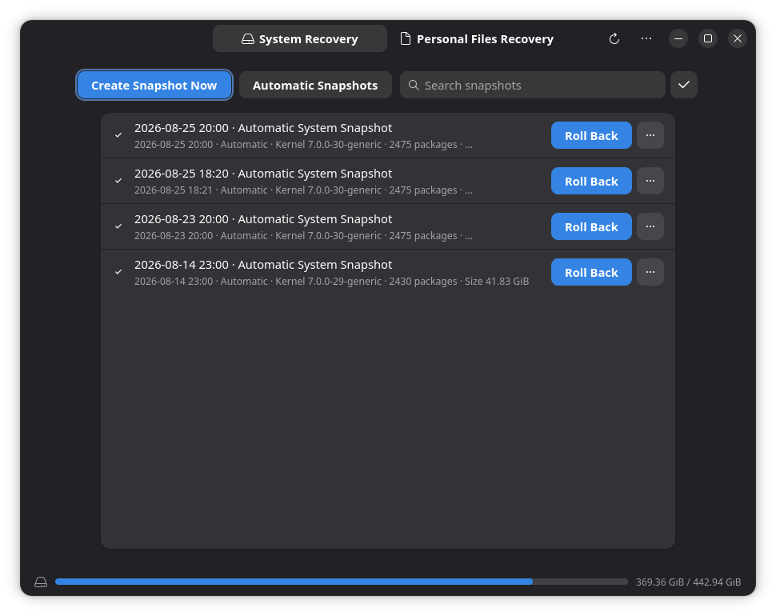
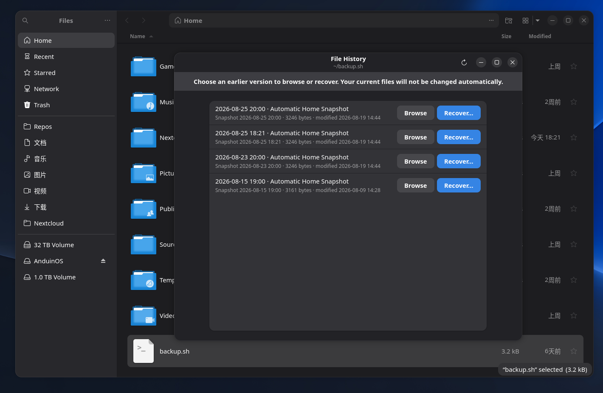
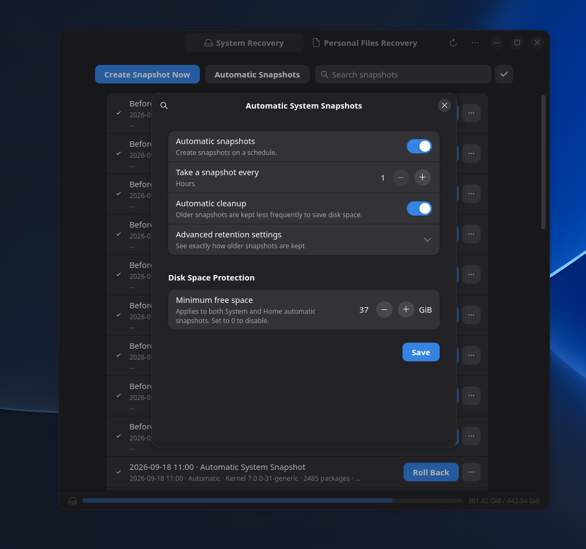
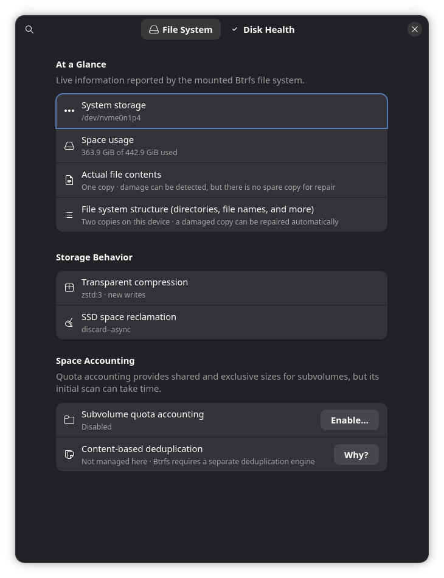
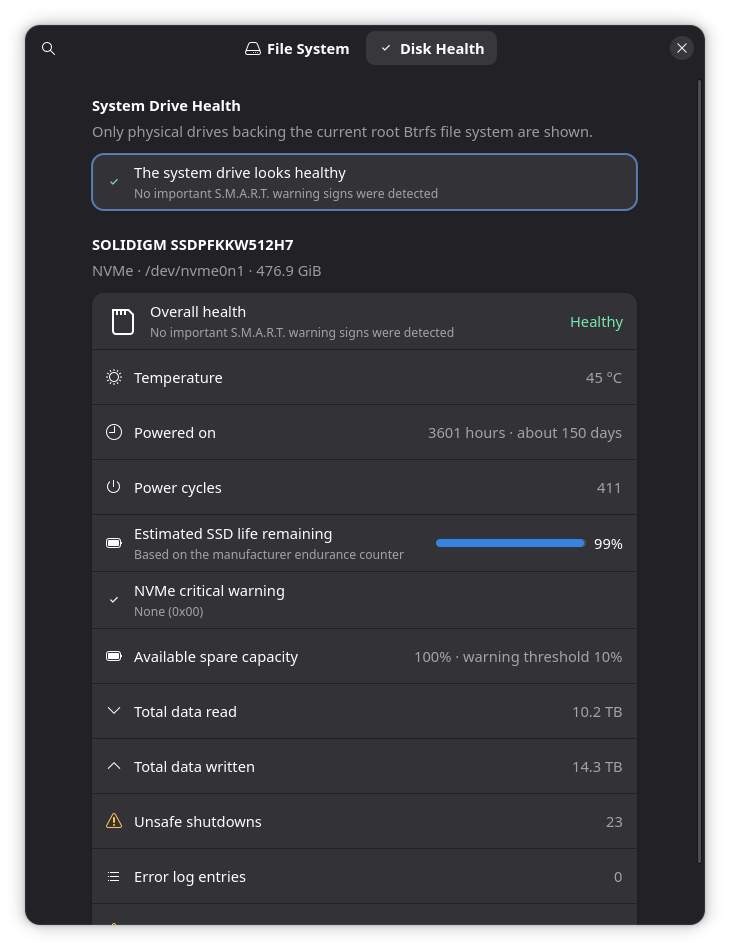

# Disk Snapshots Manager

Disk Snapshots Manager provides fast local recovery for supported AnduinOS Btrfs installations. It keeps system snapshots and Personal Files snapshots separate: an ordinary system rollback leaves Home unchanged. Factory reset additionally offers an explicit choice to reset Home, as described below.

**Important: Snapshots are not backups.** Snapshots normally remain on the same physical disk as the live system. They are useful for recovering from a broken update, configuration change, or accidental file edit, but they do not protect against disk failure, theft, or loss of the computer. Keep an independent backup on another disk or service.

The application is installed on new Btrfs systems. It is not used on Ext4 installations because Ext4 does not provide the required Btrfs subvolume and snapshot model.

Open **Control Panel → Backup and Recovery → System Snapshots**.

## System Recovery

The **System Recovery** page manages read-only snapshots of the operating system. Each row records when and why the snapshot was created, together with information such as the kernel and package count.

Select **Create Snapshot Now** before a risky system change. Automatic and package-management snapshots may also appear here according to the configured policy.

The actions for a system snapshot include browsing its files, viewing properties, changing protection, deleting it, and preparing a rollback when the snapshot is healthy and available.

### Roll back the operating system

Use **Roll Back** when an update or system configuration change has made AnduinOS unusable or unstable.

1. Save your current work and close applications.
2. Select the intended system snapshot and choose **Roll Back**.
3. Read the confirmation carefully and authenticate when requested.
4. Allow Disk Snapshots Manager to prepare the recovery files.
5. Restart when prompted. Once rollback preparation has been armed, the computer also starts an automatic 60-second restart countdown.
6. Let the recovery boot finish without interrupting power.

Before changing the active system root, the recovery engine creates and protects a fallback snapshot of the current system. The selected snapshot remains reusable after a successful rollback.

**Warning: Personal Files are not rolled back.** An ordinary system rollback changes the operating-system root but deliberately leaves Personal Files unchanged. This prevents a driver or package rollback from silently discarding newer documents. Recover older personal files separately from **Personal Files Recovery**. Use Home snapshot rollback separately when you want to restore all users' files and settings.

## Factory reset

Factory reset returns system files, installed packages, and system settings to the initial installed **New OS** state. That state is captured after the installer has applied the selected configuration and optional package changes; it is not a fresh download of the latest release.

### Requirements

- A supported AnduinOS Btrfs layout, with a healthy installer-created **New OS** system snapshot.
- An installed snapshot manager that supports the factory-reset workflow.
- Enough available space to prepare the current-system safety snapshot and recovery files.
- A recovery boot configuration that passes the manager's readiness checks.
- For **Roll back user data**, a healthy initial Home recovery point as well.

The installer creates the protected **New OS** baselines in both System Recovery and Personal Files Recovery on supported Btrfs installations. Automatic cleanup never removes them. The **New OS** baseline cannot be renamed or unprotected; deliberate deletion requires a warning confirmation because it disables factory recovery.

### Choose what to reset

**Roll back user data is unchecked by default.** Leave it unchecked to preserve current Home files and user settings.

1. Back up files you want to keep to another device or service, save your work, and close applications.
2. Open **Control Panel → Backup and Recovery → Factory Reset**. Control Panel opens the snapshot manager, which checks availability and prepares the operation.
3. Read the confirmation. Leave **Roll back user data** unchecked to preserve Home, or select it only if you intend to restore Home to its initial installed state too.
4. Select **Reset and Restart** and authenticate when requested. The manager repeats its readiness checks and creates safety snapshots of the affected scopes before arming recovery.
5. Once recovery is armed, the computer restarts automatically within 60 seconds. Let recovery and the subsequent boot finish without interrupting power.

| Choice | System files and packages | Home files and user settings | Home snapshot history |
| --- | --- | --- | --- |
| Default reset | Restored to New OS | Preserved | Preserved |
| Roll back user data selected | Restored to New OS | Restored to the initial Home baseline | Preserved |

Home reset affects the shared Home subvolume, including other users' Home directories. The initial baseline can contain account files and defaults created during installation; it is not necessarily empty. The current-system safety snapshot does not provide an independent backup of your personal files. Home rollback also creates a Home safety snapshot; older snapshots remain browsable and reusable, subject to the configured retention policy.

This is a snapshot-based reset, not a secure disk wipe or a reset of every data location. Separate storage such as external disks, persistent logs, container data, and virtual-machine images is outside the system-root and Home reset scope. The feature is not a data-sanitization procedure for selling a computer.

If the factory Home baseline is missing or damaged, **Roll back user data** is unavailable. If the system baseline or layout is unsupported, the application explains that factory reset is unavailable. Other preparation errors, such as insufficient space, must be resolved before a restart can be scheduled. See [recovery troubleshooting](../../../Install/Troubleshoot-Updates-and-Recovery.md).

## Personal Files Recovery

The **Personal Files Recovery** page manages snapshots of Home directories independently from the operating system.

Select **Browse Files** to explore the contents of a snapshot. You can recover a file or folder without replacing the whole Home directory. Recovery writes an ordinary copy chosen by the current user; when necessary, the application uses a distinct recovered name instead of silently overwriting unrelated data.

Personal Files history is restricted to the authenticated user's own Home directory. System snapshot browsing requires administrator authorization.

### Roll back user data

Choose **Roll Back** on a Home snapshot, authenticate as an administrator, and
confirm the restart. This restores **all users' Home files and settings** to the
selected snapshot without replacing the system. The manager creates a Home
safety snapshot first and keeps snapshot history. **Browse Files** remains
available in the snapshot's menu without a restart.

Home rollback requires compatible local account directories and UID/GID
ownership. A mismatch or nested Btrfs subvolumes in Home blocks the operation:
ordinary snapshots do not recursively capture nested subvolume contents.
Do not use this recovery feature as a secure data-erasure procedure.

## Recover an earlier version from Files

Disk Snapshots Manager integrates with Files (Nautilus). Right-click one local Home file and choose **View File History…**, or right-click a Home folder and choose **Browse This Folder's History…**.

The File History window lists snapshots containing the selected item:

- **Browse** opens that historical version without changing the current file.
- **Recover…** writes a recovered copy after you choose the destination.

Only local paths inside the user's Home directory are eligible. Network locations, mounted external paths, and special files are not exported through this workflow.

## Automatic snapshots and cleanup

Select **Automatic Snapshots** on either recovery page to configure that scope. System and Personal Files schedules are independent.

You can configure:

- whether automatic snapshots are created;
- the freshness interval, from one to 24 hours;
- whether old snapshots are cleaned automatically;
- how long to keep every snapshot;
- daily, weekly, monthly, and yearly representatives; and
- **Disk Space Protection → Minimum free space**, shared by the System and Home automatic-snapshot settings.

If the computer is asleep or powered off when a snapshot was due, the scheduler creates at most one catch-up snapshot on its next check, provided the creation checks pass. Protected snapshots and snapshots involved in an active recovery transaction are not removed by automatic cleanup.

### Free-space protection

The minimum defaults to **40 GiB**. When available filesystem space is below the configured value, the scheduler skips creating new scheduled snapshots. Enabled retention cleanup still runs according to its normal rules; it does not delete protected snapshots to force space above the limit. Creation can resume on a later scheduler check once available space reaches the configured minimum.

The settings window reports **Automatic snapshots paused** for the affected scope, and a desktop notification explains the pause. A small disk can fall below 40 GiB soon after installation, even though the installed system and its initial recovery points are valid. Review this setting if the default is unsuitable for your disk.

System and Home have independent schedules, but share this minimum setting. The available space is checked for each scope's filesystem. Set the value to **0** to disable this additional scheduled-snapshot limit; ordinary storage and operation checks still apply.

This setting does not apply to manually requested snapshots, package-transaction snapshots, installer-created factory baselines, or the safety snapshot required for a recovery transaction. Those operations can still fail their own space checks. Pausing scheduled snapshots therefore does not disable all snapshot creation.

AnduinOS also creates a system snapshot before a real DPKG package transaction by default. Advanced Settings controls this behavior and its notifications.

## Snapshot protection, deletion, and size

Ordinary protected snapshots are excluded from automatic cleanup while protected. Other manual, automatic, and package-change snapshots can participate in automatic cleanup. Factory baselines have the additional protection and deletion rules described under [Factory reset](#factory-reset).

Btrfs snapshots share unchanged data. The apparent size of several snapshots must not be added together as though each were a complete independent copy. Open **Properties** when you need the size information available for one snapshot. Enabling Btrfs quota accounting can provide shared and exclusive subvolume sizes, but its initial scan may take time.

The storage bar at the bottom of the main window reports use of the Btrfs filesystem. If free space becomes low, remove unneeded unprotected snapshots or adjust retention instead of deleting files inside snapshot storage manually.

## File system information

Open the application menu and select **Information** to inspect the mounted root Btrfs filesystem.

The page explains physical data redundancy, duplicated file-system metadata, transparent compression, SSD discard behavior, quota accounting, and whether content-based deduplication is managed. These are live properties of the mounted filesystem, not generic recommendations for another disk.

## Disk health

The **Disk Health** tab reports physical drives backing the current root Btrfs filesystem. It summarizes S.M.A.R.T. health, temperature, power history, SSD endurance, NVMe warnings, data read and written, and relevant error counters when the device supplies them.

A healthy result means no important warning was reported at the time of the check. It does not replace backups or guarantee that a drive cannot fail. Unsupported, unavailable, and incomplete S.M.A.R.T. reports are shown separately rather than treated as healthy values.

## Choose the right recovery method

| Situation | Recommended method |
|---|---|
| A package or driver update broke the system | System snapshot rollback |
| A document was edited or deleted | Personal Files history |
| Return a supported installation to its initial system state | Factory reset, preserving Home by default |
| Also return Home files and settings to their initial state | Factory reset with Roll back user data, after independent backup |
| The internal disk failed or the computer was lost | Independent external or cloud backup |
| An Ext4 installation needs file protection | Deja Dup, cloud sync, or another backup tool |

See [Backup and Restore](../../../Install/Backup-And-Restore.md) for an independent backup strategy.
