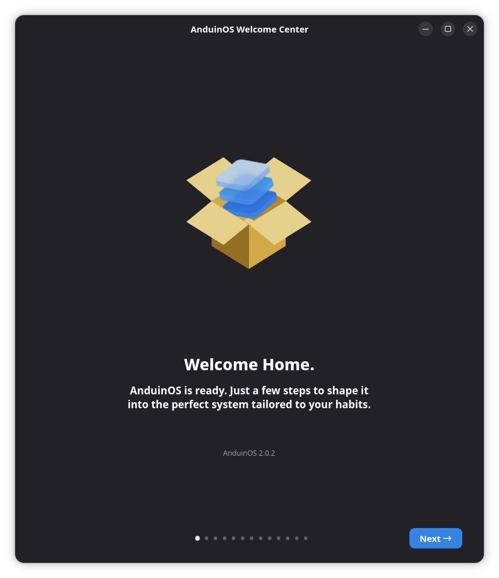
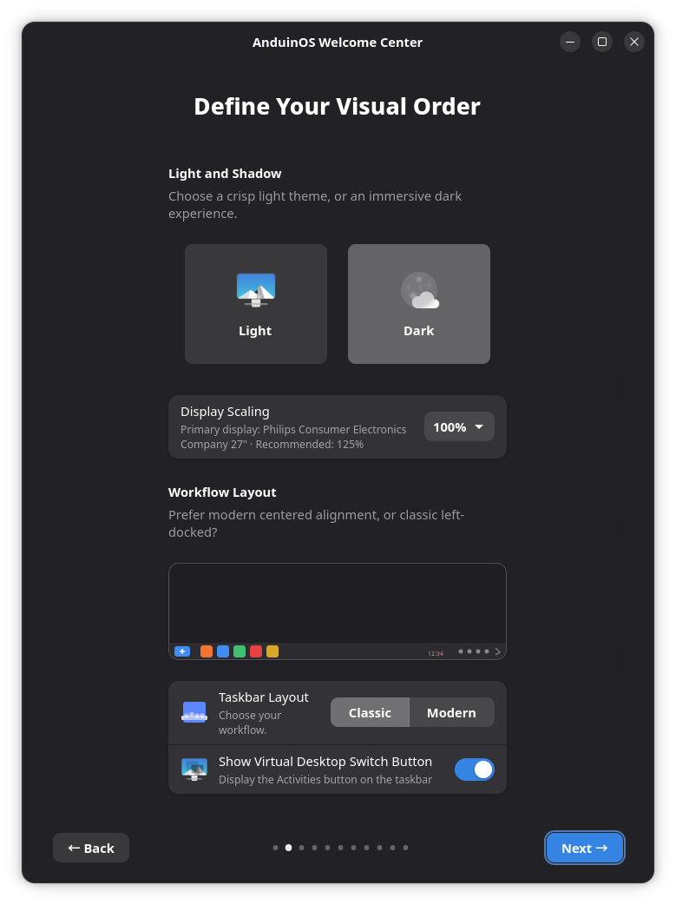
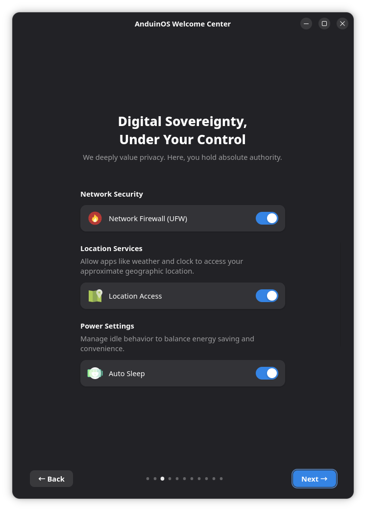
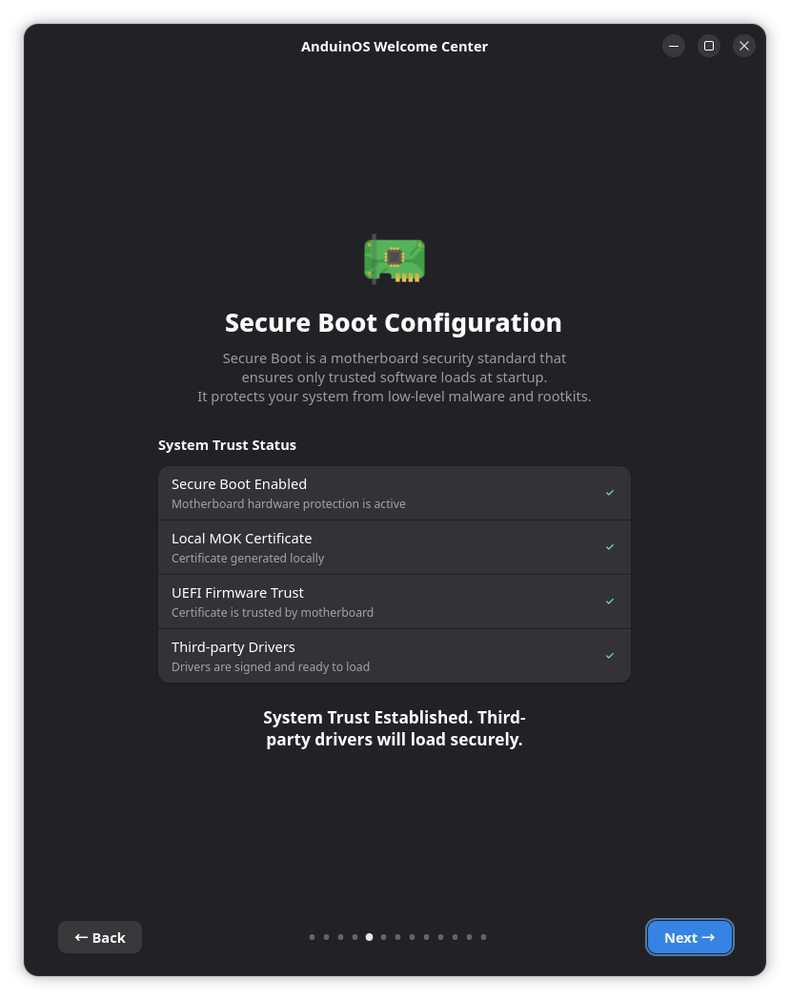
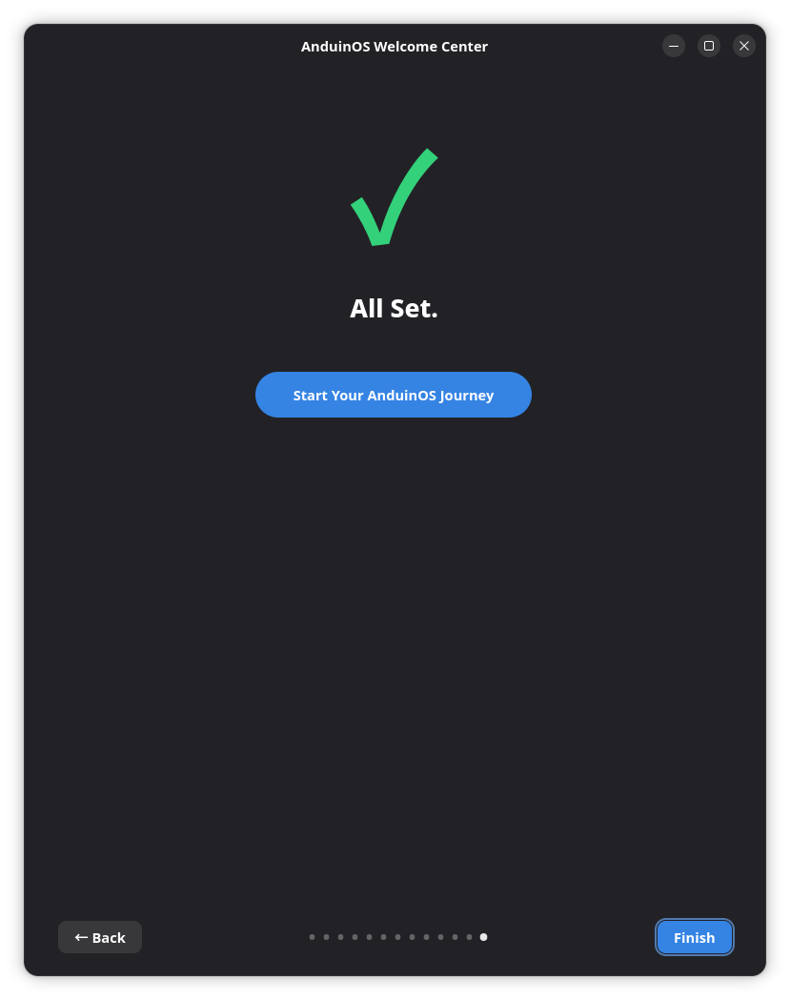

# AnduinOS Welcome Center

AnduinOS Welcome Center introduces the most useful desktop choices after installation. It opens automatically for a new user and remains available as **AnduinOS Welcome** in the application menu, so you can revisit the pages later.

The Welcome Center is not the operating-system installer. It works inside an already installed user session and applies only the choices you make there.



The dots at the bottom show how far you have progressed. The exact number of pages can change according to network connectivity, language, CPU architecture, and Secure Boot state.

## Choose the desktop appearance

**Define Your Visual Order** applies the first desktop choices immediately:

- light or dark appearance;
- the primary display's supported scaling, with a **Recommended** choice when the display provides suitable information;
- Classic or Modern taskbar layout; and
- whether the virtual-desktop switch button appears on the taskbar.

Opening the page does not change display scaling. Selecting a scale applies it while preserving the display resolution; screens without usable physical dimensions may not have a recommendation.



These are not one-time decisions. You can later use [AnduinOS Appearance](../AnduinOS-Appearance/AnduinOS-Appearance.md) for additional layouts, taskbar positions, panel widgets, desktop icons, and sign-in-screen appearance.

## Select local system policies

**Digital Sovereignty, Under Your Control** offers three choices:

- **Network Firewall (UFW)** controls inbound network protection.
- **Location Access** allows applications such as Weather and Clocks to request approximate location.
- **Auto Sleep** controls automatic suspend while the computer is idle.



The switches change real system or user settings; they are not merely preferences for the Welcome Center. A system-level change can request administrator authorization.

## Verify Secure Boot trust

When Secure Boot is enabled, the Welcome Center shows the machine's signing and enrollment state.



A healthy state confirms that:

- UEFI Secure Boot is active;
- the machine has a local MOK certificate;
- the certificate is enrolled in the machine's MOK trust store; and
- third-party driver modules are signed and ready to load.

If enrollment or repair is still needed, follow the actions offered on this page and complete the firmware-side enrollment during restart. See the [Secure Boot Guide](../../../Install/First-Boot-For-Secure-Boot.md) for the exact MOK process.

The page is omitted when Secure Boot is known to be disabled or unsupported. Its absence does not mean Welcome Center failed to detect the rest of the system.

## Finish or return later

The final page closes first-run setup and starts the normal desktop session.



Selections made on earlier pages have already been applied; **Finish** does not batch them into a second operation. To review the guide later, search for **AnduinOS Welcome** in the application menu or run:

```bash
anduinos-oobe
```

## Check hardware drivers

**Configure Hardware Drivers?** provides a direct entry into [AnduinOS Driver Center](../Driver-Center/Driver-Center.md). Opening Driver Center does not install a driver automatically. It lets you inspect graphics, audio, printing, Xbox controller, firmware, DKMS, and Secure Boot health before choosing an action.

This page is always offered, even when the computer currently needs no additional driver. Select **Skip** when you prefer to inspect hardware later.

## Decide whether to enable Windows compatibility

On supported non-ARM systems, **Run Windows Apps, with ease** offers to install Bottles from Flathub. This download is optional and can be skipped without affecting native AnduinOS applications.

If Bottles is already present, the page offers **Configure Bottles** instead. Installing Bottles here prepares the main compatibility application; [Windows EXE Runner](../Windows-EXE-Runner/Windows-EXE-Runner.md) completes its own reusable bottle setup when you first open a Windows executable.

ARM64 systems omit this page because the normal Bottles workflow targets x86 Windows programs.

## Learn the desktop shortcuts

**The Magic at Your Fingertips** presents common AnduinOS shortcuts, including:

- <kbd>Super</kbd> + <kbd>Shift</kbd> + <kbd>S</kbd> for screenshots;
- <kbd>Super</kbd> + <kbd>G</kbd> for screen recording;
- <kbd>Super</kbd> + <kbd>E</kbd> for Files;
- <kbd>Ctrl</kbd> + <kbd>Alt</kbd> + <kbd>T</kbd> for Terminal;
- <kbd>Super</kbd> + <kbd>V</kbd> for clipboard history;
- <kbd>Super</kbd> + <kbd>U</kbd> for network statistics; and
- <kbd>Super</kbd> + arrow keys for window placement.

The page only teaches the shortcuts; it does not silently replace custom bindings. See [Keyboard Shortcuts](../../../Install/Keyboard-Shortcuts.md) for the complete reference.

## Discover applications

**Productive From Day One** presents a curated set of browsers, developer tools, communication clients, office applications, media tools, and creative software. Selecting an application opens its detail page in the App Store; it does not install every recommendation automatically.

The list can include region-specific applications. For example, Simplified Chinese users can see WeChat, QQ, and WPS Office alongside the general recommendations. Already installed Flatpak applications are marked accordingly.

This page requires an Internet connection and disappears from the current run after you choose **Continue Offline**.

## Conditional pages

Welcome Center can also show pages for:

- connecting to Wi-Fi or continuing offline;
- opening Driver Center;
- configuring the mainland-China Flathub mirror;
- preparing Bottles for Windows applications on supported architectures;
- learning keyboard shortcuts;
- discovering recommended applications;
- reviewing privacy choices; and
- finding AnduinOS community and support resources.

ARM64 systems omit the Bottles page because the supported Bottles workflow is intended for x86 Windows applications. Network-dependent pages are removed after **Continue Offline**, while local appearance, privacy, security, and help pages remain available.

For software sources, local network discovery, command predictions, and backup tools, see [Control Panel](../Control-Panel/Control-Panel.md).
