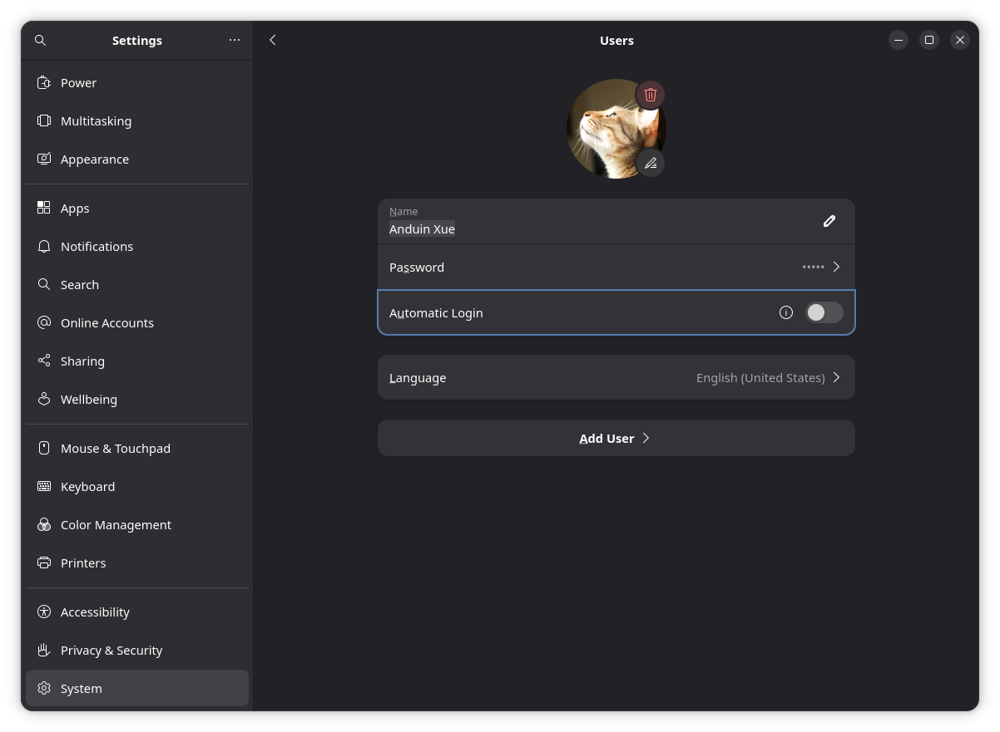

# Accounts, passwords and automatic login

Open **Settings → System → Users** to manage user accounts.

## Which password does sudo need? What is the root password?

Use the password of your administrator account when `sudo` asks. The installer locks root password login; there is no default root password to guess. `su` and `sudo` are different operations. For a temporary administrator shell, an authorized administrator can use `sudo -i` and leave it with `exit`.

The installer requires a non-empty account password. Automatic desktop login and passwordless administrator commands are separate options; neither creates a passwordless account or removes the account password.

| Prompt or setting | What it controls |
| --- | --- |
| User password | Signing in and authenticating that account |
| Automatic Login | Opening the desktop at startup without typing the user password |
| Passwordless sudo | Administrative commands; see [sudo settings](./Allow-Sudo-Without-Password.md) |
| Disk-encryption passphrase | Unlocking encrypted storage before login |
| Login keyring | Stored application secrets; may still prompt after automatic login |
| MOK enrollment code | Secure Boot certificate enrollment, not the account password |

## Change your password or add another user

In **Users**, select your account and open the **Password** row. To create another account, use **Add User** below the account settings. Authenticate with an administrator account when prompted. Give other people separate accounts; choose Standard unless they need administrator access.

In a terminal, `passwd` changes your own password. An existing administrator can reset another local account with `sudo passwd username`, replacing `username` with the actual login name. The new password is entered at the prompt, not as part of the command.

See [GNOME's password instructions](https://help.gnome.org/gnome-help/user-changepassword.html) for the graphical flow.

## Log in without typing a password

Open **Users** and select the intended account. **Automatic Login** is the row immediately below **Password** in the example. Authenticate or unlock the page if requested, turn the switch on, and restart to test it. Turn it off to restore the login prompt.

{ width=840 }

The gray **Automatic Login** switch is off in this screenshot. Changing it does not remove an existing account password, disable disk encryption, or grant passwordless sudo. Anyone with physical access to an automatically opened desktop can access that user's files.

If login still prompts, distinguish a disk-unlock prompt, a desktop login, a lock-screen prompt and a keyring prompt. Automatic login affects startup login, not every authentication step. See [GNOME automatic login](https://help.gnome.org/gnome-help/user-autologin.html).

## Forgotten password

First check the keyboard layout and Caps Lock. If another administrator account is available, sign into it and reset the affected account as above. Resetting a login password does not decrypt a forgotten disk passphrase or unlock a keyring protected by the old password.

If no administrator can sign in, use trusted recovery media and seek help appropriate to your disk layout and encryption before modifying accounts. Record whether the disk is encrypted and whether a backup exists. There is no universal Live-USB reset command that safely fits every encrypted, Btrfs or multi-boot installation. See [boot and recovery troubleshooting](./Troubleshoot-Updates-and-Recovery.md).

If you can sign in but a keyring rejects the new password, use Passwords and Keys to inspect it. Do not delete the keyring unless you accept losing its stored secrets. For login-screen appearance, see [desktop personalization](./Shortcuts-and-Appearance.md).
