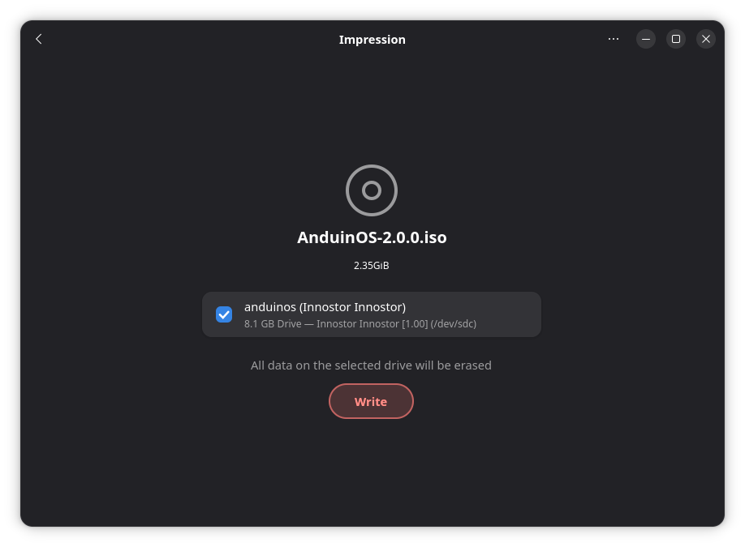

# Bare-metal Installation - Make a USB installer

First, [download the latest release of AnduinOS](./Download-AnduinOS.md).

Then, create a bootable USB drive with the downloaded ISO file. Obviously, you need a USB drive with at least **4GB** of storage.

## Windows

---

If you are using a Windows machine, we recommend using **Rufus** to create a bootable USB drive.

!!! note "Rufus"
    You can download Rufus from the [official website](https://rufus.ie/).

!!! warning "Use `dd` mode in Rufus instead of `ISO` mode!"

    When using Rufus, make sure to select the **`dd` mode** to create a bootable USB drive. This will ensure that the USB drive is bootable on both UEFI and legacy BIOS systems. The default `ISO` mode might cause boot failures with AnduinOS.

## Linux

---

If you are using a Linux machine, the most user-friendly way to burn the ISO is using **Impression**.

You can install Impression easily via Flatpak:

[Get Impression on Flathub](https://flathub.org/en/apps/io.gitlab.adhami3310.Impression){ .md-button .md-button--primary }



### Alternative: Using the command line (`dd`)

If you prefer the command line, you can use the `dd` command to burn the ISO file to a USB drive.

First, you must identify the device name of the USB drive. You can use the `fdisk` or `lsblk` command to list all block devices on your system.

```shell title="List block devices"
sudo fdisk -l
```

Then, use the `dd` command to burn the ISO file to the USB drive. Replace `<device>` with the device name of your USB drive (e.g., `/dev/sdb`, **NOT** `/dev/sdb1`).

```shell title="Burning ISO to USB using dd on Linux"
sudo dd if=./AnduinOS.iso of=<device> status=progress oflag=sync bs=4M
```

!!! warning "Data Loss!"

    This command will erase all data on the USB drive. Make sure to back up your data before running this command, and double-check that you typed the correct `<device>` path!

## macOS

---

If you are on a Mac, we recommend using **BalenaEtcher**, which is a cross-platform, graphical tool that makes flashing ISOs incredibly simple and safe.

1. Download and install [BalenaEtcher](https://etcher.balena.io/).
2. Open BalenaEtcher, click "Flash from file" and select the AnduinOS ISO.
3. Select your target USB drive.
4. Click "Flash!"

Alternatively, advanced macOS users can use the built-in `dd` command in the Terminal (similar to Linux).

## Advanced: Ventoy

---

If you frequently install operating systems or want to keep your USB drive usable for normal file storage while still being bootable, **Ventoy** is highly recommended.

1. Install [Ventoy](https://www.ventoy.net/) onto your USB drive.
2. Once installed, your USB drive will have an empty partition.
3. Simply **copy and paste** the AnduinOS ISO file directly into the USB drive as a normal file.
4. Boot from the USB drive, and Ventoy will present a menu allowing you to choose the AnduinOS ISO to boot from.

This method completely avoids the need to repeatedly flash or wipe your USB drive!
