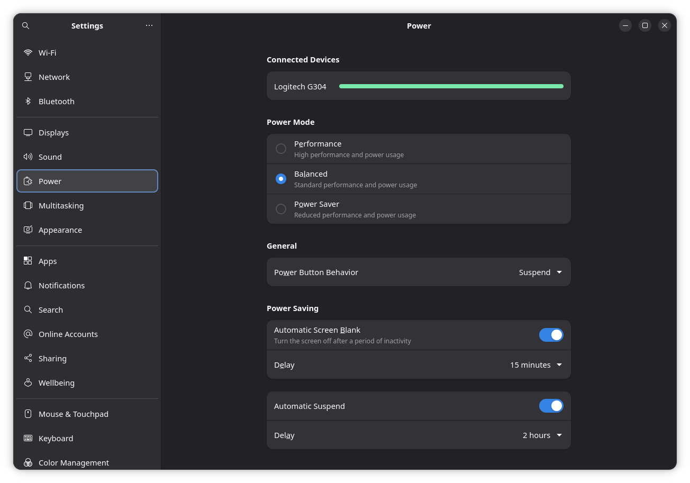

# Configure Power Settings

When you install AnduinOS, the system is designed to save energy by default. It will automatically dim your screen, lock your session, and put the computer to sleep if left inactive.

For many users (especially those on desktop computers, or those who leave long-running downloads or server tasks active), these defaults might be too aggressive. 

You can easily adjust these settings using the graphical interface.

## Adjust Power & Sleep Settings

1. Open your application menu and launch **Settings**.
2. Navigate to the **Power** tab on the left sidebar.
3. In this panel, you can adjust:
   * **Power Mode:** Choose between *Performance*, *Balanced*, or *Power Saver* depending on your workload and battery needs.
   * **Screen Blank:** Set how long the screen should wait before turning off (e.g., 5 minutes, 15 minutes, or *Never*).
   * **Automatic Suspend:** Configure whether the system should go to sleep when idle (and set different rules for when plugged in vs. on battery).

## Adjust Auto Lock Settings

If you set your screen to blank, AnduinOS will lock your session by default for security. If you are using a home desktop and find typing your password annoying, you can disable this:

1. Open **Settings** and go to **Privacy** -> **Screen**.
2. Toggle **Automatic Screen Lock** to the **OFF** position, or increase the **Automatic Screen Lock Delay**.

---
*For advanced power management via the command line (like masking sleep targets or using `gsettings` and `cpupower`), please refer to our [Advanced Power Management](../Skills/System-Management/Advanced-Power-Management.md) guide.*
