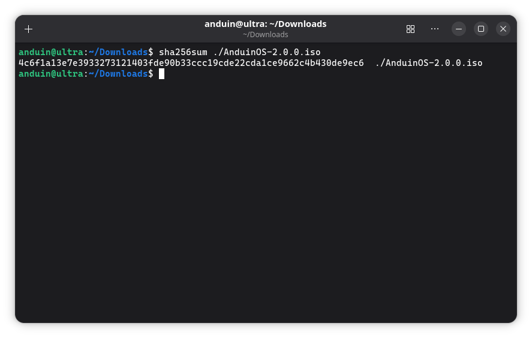

# Download AnduinOS

---

Before installing AnduinOS, you need to download the ISO file from the releases page.

[Download AnduinOS (ISO)](https://www.anduinos.com/){ .md-button .md-button--primary }

It is suggested to use [qbittorrent](https://www.qbittorrent.org/) to download the ISO file via Torrent, as it supports torrent and helps seed the file to others. You can also use other torrent clients like [Transmission](https://transmissionbt.com/) or [Deluge](https://deluge-torrent.org/).

## Verify the ISO sha256 checksum

After downloading the ISO file, you should verify the integrity of the file to ensure that it has not been tampered with.

To verify the ISO file, you can use the `sha256sum` command on Linux or macOS, or the `7-Zip` software on Windows.

```bash title="Verify ISO file"
sha256sum ./AnduinOS.iso
```



Please compare the output of the `sha256sum` command with the checksum provided on the releases page (File ends with `.sha256`). If the checksums match, the ISO file is valid and has not been tampered with.

!!! note "Multi-language Support"

    All 28 supported languages ship in a **single ISO**. You can select your preferred language directly from the GRUB boot menu before entering the live session — no separate download needed, and no post-install language switching required.
