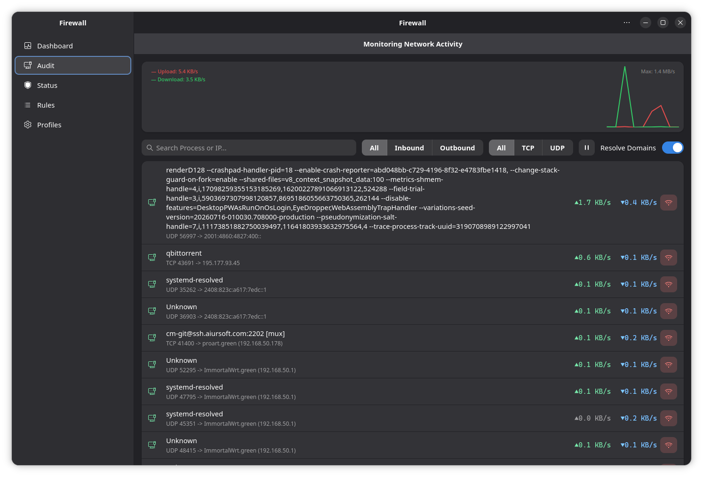
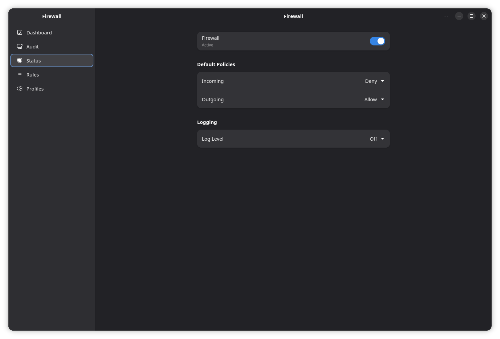
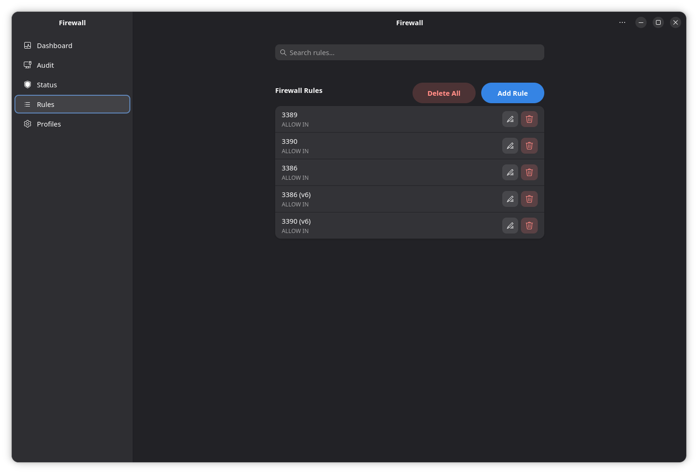

# Enable Firewall on AnduinOS

!!! warning "Firewall is Disabled by Default!!"

    The firewall is disabled by default in AnduinOS. This is a deliberate choice to enhance user experience and avoid unnecessary complications. You can enable it at any time using the command `sudo ufw enable`.

## Why is the Firewall Disabled by Default in AnduinOS?

If you're new to AnduinOS or Linux in general, you might be surprised to find that its built-in firewall, UFW (Uncomplicated Firewall), is not active right after installation. This may seem like a security oversight, but it's actually a deliberate design choice rooted in a philosophy of "secure by default" and prioritizing user experience. In a fresh AnduinOS system, there are no network services listening for incoming connections. With no open doors, there is nothing for a firewall to protect. The system is inherently secure because it doesn't offer any entry points for potential attackers to target.

The primary reason for keeping the firewall off by default is to prevent a frustrating user experience. Imagine if the firewall were active from the start, blocking all incoming connections. When you later decide to set up a service, like SSH for remote access, a Samba share for local network files, or a web server for development, it would fail to connect without any obvious reason. You would be left troubleshooting a perfectly configured service, only to eventually discover it was being silently blocked by a firewall you didn't even know was active. AnduinOS avoids this "trap" by giving you, the user, the control to enable and configure the firewall precisely when you need it—that is, when you start running services that need to be accessed.

This "clean slate" approach also aligns perfectly with modern computing practices. In cloud environments like AWS or Google Cloud, network security is typically managed at a higher level by "Security Groups," making a host-based firewall redundant and an extra layer of complexity. Similarly, for users who automate deployments with tools like Ansible, starting with a predictable, disabled firewall makes scripting easier and more reliable. UFW remains a powerful and simple tool, ready for you to enable with a single command (`sudo ufw enable`) as soon as you open your first network port to the world.

## (Recommended) Enable Firewall via Welcome Center

For most users, the easiest way to manage your firewall without touching the command line is through the **AnduinOS Welcome Center**:

1. Open **Welcome Center** (AnduinOS OOBE) from your application menu.
2. Navigate to the **Security & Privacy** page.
3. Locate the **Network Firewall (UFW)** card and toggle it **On**.

The Welcome Center will securely enable the firewall in the background.

## (Recommended) Advanced Configuration via Firewall App

While the Welcome Center provides a convenient on/off switch, you will often need to create specific rules (such as allowing SSH, or opening a port for a web server). For this, AnduinOS includes a dedicated, user-friendly graphical application called **Firewall** (based on `ufwall-gtk`).

1. Open your application menu and search for **Firewall**.
   *(If it's not installed, you can easily install it via the App Store or terminal: `sudo apt install anduinos-ufwall-gtk`)*.
2. Enter your password to unlock the interface.
3. Turn the **Status** toggle to **ON**.



4. To safely allow SSH or other services:
   - Navigate to the **Rules** tab.



   - Click the **+** button at the bottom.
   - Choose **Preconfigured** or **Simple** to easily allow services like SSH, HTTP, etc.
   - Click **Add**.



This is the safest and most intuitive way to ensure you don't accidentally lock yourself out!

## (Alternative) Command Line Installation

To enable the firewall on AnduinOS using the terminal, simply run the following command:

```bash title="Enable Firewall"
sudo ufw enable
```

But this command is risky because it will block all incoming connections, including SSH. If you are connected via SSH, you will lose your connection and will not be able to reconnect until you disable the firewall or allow SSH connections.

To safely enable the firewall while allowing SSH connections, use the following commands:

```bash title="Enable Firewall with SSH"
sudo ufw allow ssh
sudo ufw enable
```
