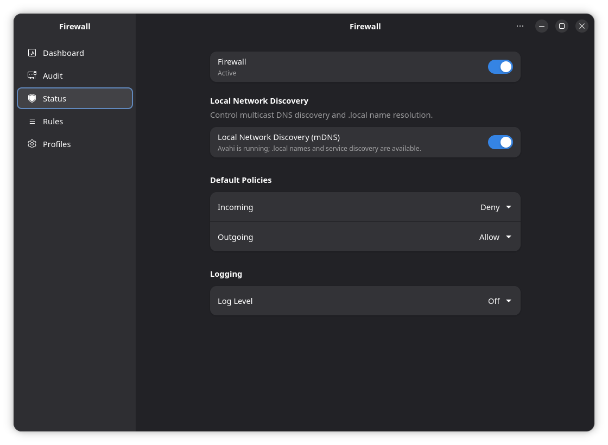
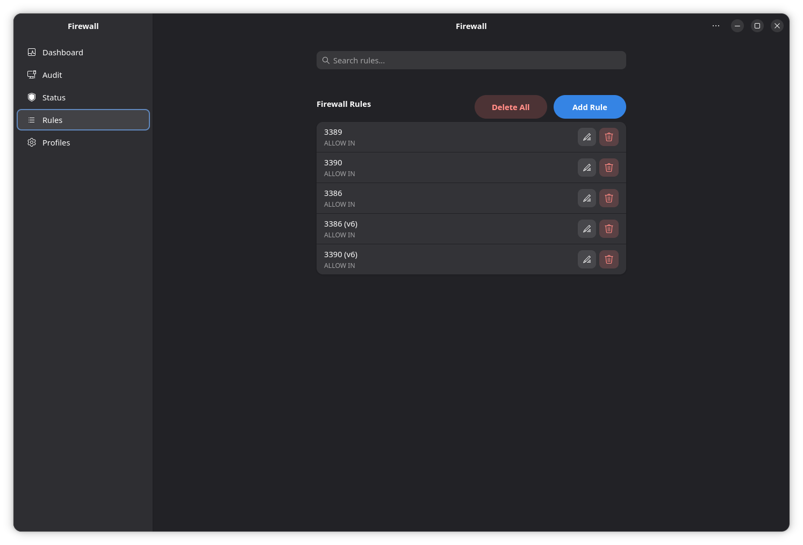
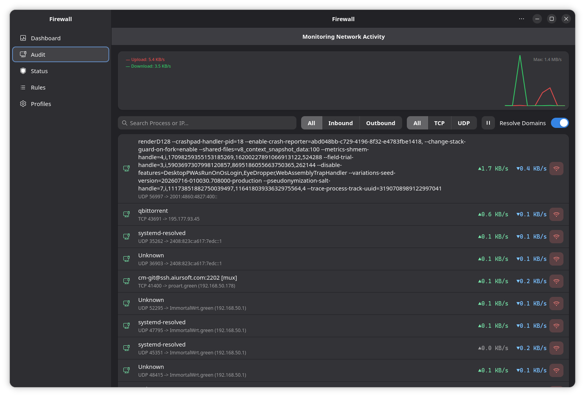

# Enable or disable the firewall on AnduinOS

!!! note "Check the current firewall state"

    Run `sudo ufw status verbose` before changing settings. The firewall can be disabled on a fresh installation; previous configuration or setup choices may change its state. The screenshot below shows an enabled firewall.

!!! danger "Do Not Lock Out Your SSH Session"

    Before enabling UFW remotely, allow the port actually used by your SSH server. For the standard OpenSSH profile, inspect and allow it with:

    ```bash
    sudo ufw app info OpenSSH
    sudo ufw allow OpenSSH
    ```

    If SSH uses a different port, allow that TCP port instead. For example, `sudo ufw allow 2222/tcp` applies only to a server listening on port 2222. Keep console or other recovery access available: enabling UFW can interrupt existing connections. After enabling it, test a new SSH connection before closing your current session.

## What does the firewall protect?

UFW filters network traffic according to its rules and default policies. A disabled firewall does not establish that the computer has no listening services or is inherently secure. Installed applications, remote-access settings and local-network services affect what is reachable.

Allow only the services you intend other devices to reach. Router rules and cloud security groups control traffic at other points in the network; they do not make the computer's own firewall irrelevant. See the [Ubuntu firewall guide](https://documentation.ubuntu.com/server/how-to/security/firewalls/index.html) for UFW configuration basics.

## (Recommended) Enable Firewall via Welcome Center

For most users, the easiest way to manage your firewall without touching the command line is through the **AnduinOS Welcome Center**:

1. Open **Welcome Center** (AnduinOS OOBE) from your application menu.
2. Navigate to the **Security & Privacy** page.
3. Locate the **Network Firewall (UFW)** card and toggle it **On**.

The Welcome Center will securely enable the firewall in the background.

## (Recommended) Advanced Configuration via Firewall App

While the Welcome Center provides a convenient on/off switch, you will often need to create specific rules (such as allowing SSH, or opening a port for a web server). For this, AnduinOS includes a dedicated, user-friendly graphical application called **Firewall** (based on `ufwall-gtk`).

1. Open your application menu and search for **Firewall**.
   *(If it's not installed, you can easily install it via the App Store or terminal: `sudo apt install anduinos-ufwall-gtk`)*.
2. Enter your password to unlock the interface.
3. Open **Status** and turn the **Firewall** switch on. If you are working remotely, allow your actual SSH port as described above first.

{ width=840 }

The top **Firewall** switch is on and its status reads **Active**. The example uses **Incoming: Deny** and **Outgoing: Allow** under **Default Policies**. **Local Network Discovery (mDNS)** has its own switch; changing it is separate from turning firewall filtering on or off. **Log Level: Off** refers to logging, not firewall status.

### Allow a service or add a rule

Open **Profiles** and turn on **OpenSSH** if this computer should accept SSH connections. Open **Rules** to review the resulting rules or choose **Add Rule** for a specific service. The ports shown below are examples, not rules every computer needs.

{ width=840 }

### Inspect network activity

Open **Audit** to inspect current network activity. Use the direction and protocol filters above the process list to focus on a connection you are troubleshooting.

{ width=840 }

See [Enable SSH](./Enable-SSH.md) for instructions on controlling the SSH listener through GNOME Settings. A firewall rule permits traffic but does not start SSH by itself.

## (Alternative) Enable from the command line

Review existing rules and default policies first with `sudo ufw status verbose`. If connected remotely, allow your actual SSH port as described above, then enable filtering and inspect the result:

```bash title="Enable Firewall"
sudo ufw enable
sudo ufw status verbose
```

Which connections are allowed depends on the configured rules and policies. Enabling UFW can interrupt existing SSH sessions; see the [UFW manual](https://manpages.ubuntu.com/manpages/questing/man8/ufw.8.html). Test a new connection after enabling it.

## Turn off the firewall and confirm its status

To disable filtering, open **Firewall → Status** and turn off the top **Firewall** switch, shown on in the example above. Authenticate if requested. Use this main switch rather than the separate mDNS switch. In a terminal, the equivalent is:

```bash
sudo ufw disable
sudo ufw status verbose
```

The status should report `inactive`. Disabling UFW keeps its configured rules for later use, but stops enforcing its policy; network services may become reachable. Prefer allowing a specific service when that is the actual goal. Other firewalls on the router or network remain independent.

To enable UFW again, first allow your actual SSH port if you are connected remotely, then run `sudo ufw enable` and inspect `sudo ufw status verbose`. Turning off UFW does not stop an SSH, Samba or other listening service.
