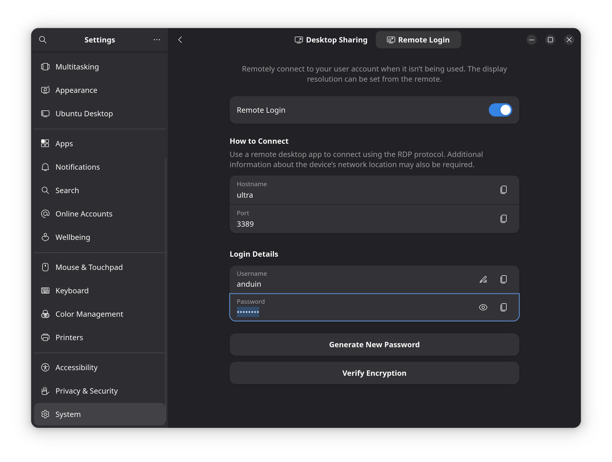

# Enable RDP to AnduinOS

RDP (Remote Desktop Protocol) allows you to connect to your AnduinOS computer and control its graphical desktop from anywhere.

!!! warning "Do NOT install `xrdp`"
    Many outdated Linux tutorials on the internet will instruct you to install the `xrdp` package to get remote desktop working. **Do not do this on AnduinOS.** 
    
    AnduinOS is a modern operating system that strictly enforces the secure **Wayland** display server protocol. The old `xrdp` package relies on the legacy X11 server and will not work correctly, potentially breaking your system's display configuration. Always use the built-in `gnome-remote-desktop` as outlined below.

## Setup RDP Server on AnduinOS

To enable RDP on AnduinOS, follow these steps.

AnduinOS comes with `gnome-remote-desktop` pre-installed, meaning you do not need to use the terminal to set up a server.

1. Open your application menu and launch **Settings**.
2. Navigate to **System** -> **Remote Desktop** (or **Sharing** -> **Remote Desktop** depending on your GNOME version).
3. Toggle the **Desktop Sharing** and/or **Remote Login** options to the **ON** position.

You will need to set a username and password for the remote connection within this menu. (Note: This credential only applies to the remote desktop connection, not your main user account).

*(Note: If you are using the AnduinOS Firewall, remember to allow RDP (port 3389) before connecting remotely. See our [Firewall Guide](./Enable-Firewall.md) for details.)*

## Connect to AnduinOS via RDP

Now that your AnduinOS machine is broadcasting an RDP signal, you can connect to it from almost any device. Because AnduinOS uses standard RDP, you can use official Microsoft apps.

### Windows

You don't need to install anything. Windows comes with RDP built-in.

1. Open the Start menu and search for **Remote Desktop Connection**.
2. Enter the IP address of your AnduinOS machine and click "Connect".
3. Enter the remote desktop username and password you configured in Settings.

### macOS

1. Open the Mac App Store and download the official **Microsoft Remote Desktop** app.
2. Open the app, click **Add PC**, and enter your AnduinOS machine's IP address.
3. Double-click the newly added PC tile to connect.

### Linux

We recommend using **Remmina**, a powerful and popular RDP client for Linux.

1. Install Remmina via your package manager (e.g., `sudo apt install remmina` or via Flathub).
2. Open Remmina, select **RDP** from the protocol dropdown next to the address bar.
3. Type in the IP address of your AnduinOS machine and hit Enter.

### Android & iOS / iPadOS

You can even control your desktop from your phone or tablet!

1. Go to the **Google Play Store** (Android) or **App Store** (iOS).
2. Search for and install the official **Microsoft Remote Desktop** (or "RD Client") app.
3. Open the app, tap the **+** icon to add a PC, enter the IP address, and connect.
