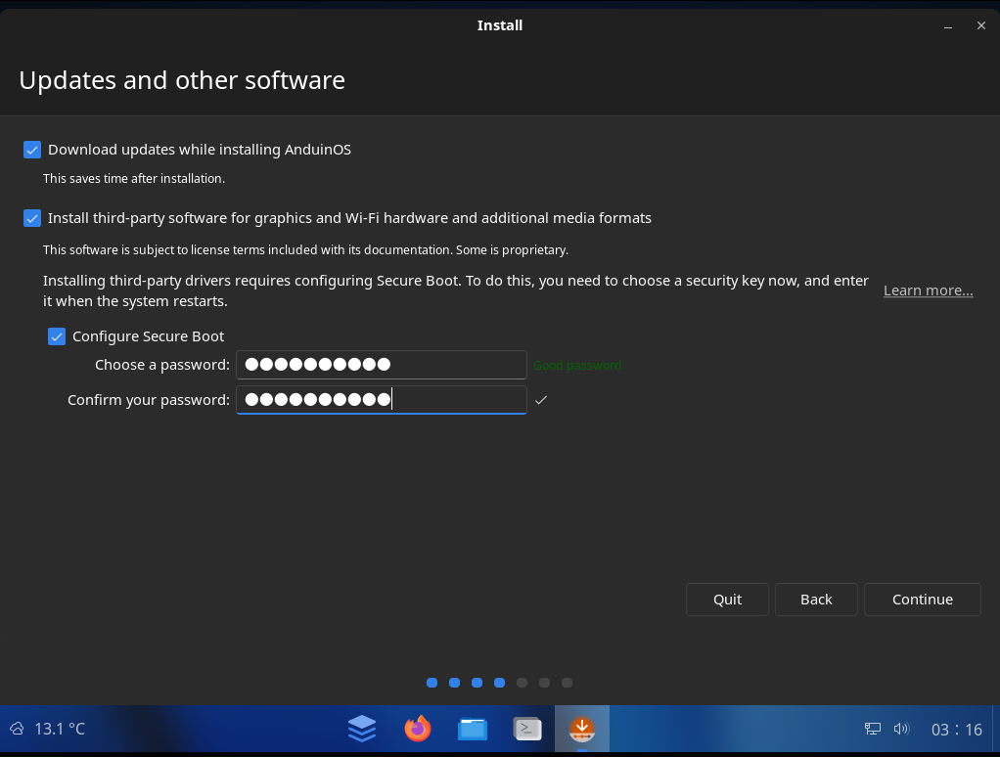
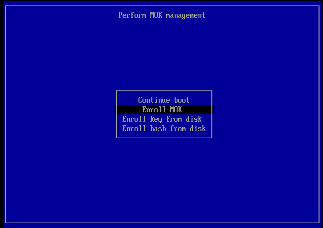
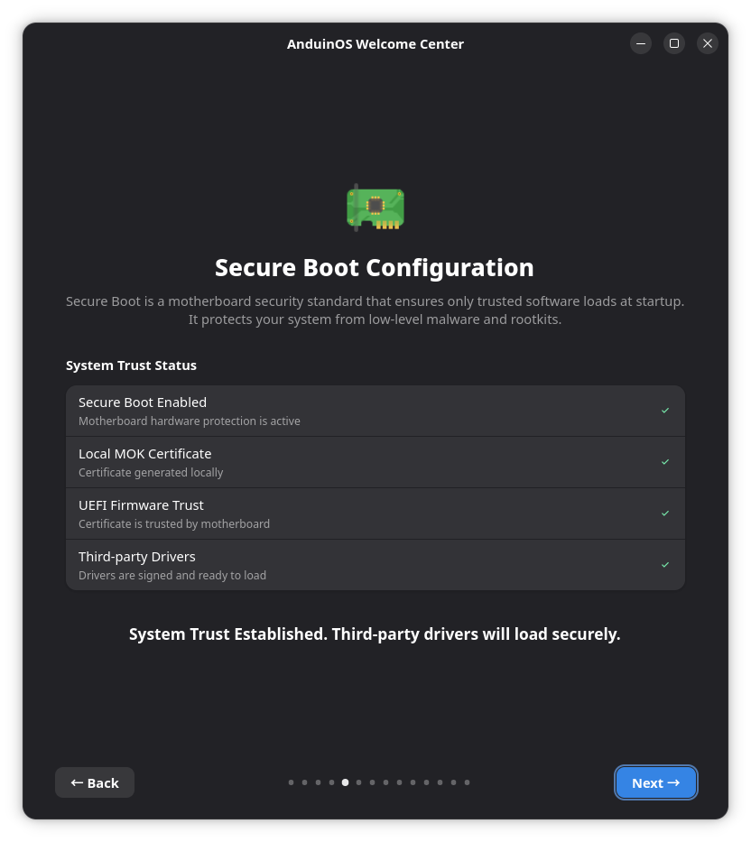

# Secure Boot Guide

AnduinOS fully supports Secure Boot, allowing you to safely run third-party drivers (such as the AnduinOS Xbox controller driver) by utilizing MOK (Machine Owner Key) enrollment.

To ensure your system remains secure, we highly recommend keeping Secure Boot enabled. This guide covers the entire Secure Boot lifecycle: from BIOS setup to first boot.

!!! warning "What happens if I skip this certificate enrollment?"
    If Secure Boot is enabled in your BIOS but you fail to enroll the AnduinOS MOK certificate, the Linux kernel will **strictly refuse** to load any third-party or proprietary drivers. This means:
    - **NVIDIA Graphics Drivers** will fail to load, resulting in poor graphical performance or screen tearing.
    - **AnduinOS Xbox Controller Driver** will be blocked, causing controllers to not vibrate or function properly.
    - **VirtualBox / VMware** kernel modules will refuse to run.
    Therefore, enrolling this certificate is a mandatory step for a fully functional desktop experience.

## 1. Before Installation: Enable Secure Boot in BIOS

To turn on Secure Boot, you need to enter your computer's BIOS/UEFI settings.

1. Power on your computer and repeatedly press your BIOS key (commonly `F2`, `F10`, `Del`, or `Volume Up + Power`).
2. Navigate to the **Security** or **Boot** tab and find the **Secure Boot** option.
3. **Enable** Secure Boot. If asked for a certificate type, set it to **Windows UEFI mode** or **Standard**.
4. Save the changes and reboot from your AnduinOS USB drive to start the installation.

## 2. During Installation: Set the Secure Boot Password

While installing AnduinOS, when you reach the "Updates and Other Software" step, the installer will detect that Secure Boot is enabled and ask you to configure a Secure Boot password.



1. Enter a strong password and confirm it. 
2. **Memorize this password!** It is required to enroll the AnduinOS Secure Boot key during your first boot.

!!! note "This is not your user password"
    This password is a temporary, one-time-use password strictly for enrolling the MOK key on first boot. Do **not** leak it, as it allows authorizing third-party kernel modules.

## 3. First Boot: Trust the AnduinOS Key

When you restart your computer after the installation completes, before loading the desktop, you will be greeted by a blue **MOKManager** screen. This is a one-time operation.

1. Press any key to enter the MOK management menu.
2. Select **Enroll MOK** and follow the on-screen prompts.



3. When prompted, select **Continue** and then **Yes** to confirm you want to enroll the key.


4. **Enter the password** you created during the installation process (Note: your keyboard layout will be the standard US layout here).
5. Select **Reboot**.

After rebooting, your system will trust the signed AnduinOS kernel and all included third-party modules.

### Troubleshooting: Forgot the Password or Skipped the Blue Screen?

If you accidentally missed the blue screen during the first boot, or if you completely forgot the password you set during installation, don't panic! You can safely "buy a late ticket" and trigger the enrollment again using the built-in system wizard.

1. Open your applications menu and launch the **Welcome to AnduinOS** wizard (`anduinos-oobe`).
2. Navigate to the **Secure Boot Configuration** page.
3. The wizard will detect that your certificate is missing and show a warning. Click the **Create & Enroll Certificate** button.
4. The system will automatically generate a new key and ask you to reboot.
5. Upon reboot, the blue MOKManager screen will appear again. Follow the same steps (`Enroll MOK` → `Continue` → `Yes`), but this time, **enter the default password `123456`** as prompted by the wizard.

## 4. Verify Secure Boot Status

Once you have booted into the AnduinOS desktop, you can easily verify that Secure Boot is active.

### Method 1: Graphical Verification (Recommended)

Open the **Welcome to AnduinOS** (`anduinos-oobe`) wizard from your applications menu and navigate to the **Secure Boot Configuration** page. 

If everything was set up correctly, you will see a screen showing "System Trust Established" with green checkmarks across all security layers:



### Method 2: Command Line Verification

Alternatively, you can open a terminal and run:

```bash title="Check Secure Boot status"
sudo mokutil --sb-state
```

You should see `SecureBoot enabled` in the output. Your system is now fully secure and ready to use!

!!! note "How does this work under the hood?"

    For a deeper dive into the signing architecture — how UEFI, Shim, the kernel, DKMS, and the OOBE state machine all fit together — see the [Secure Boot Signing Architecture](./Secure-Boot-Signing-Architecture.md) reference.
