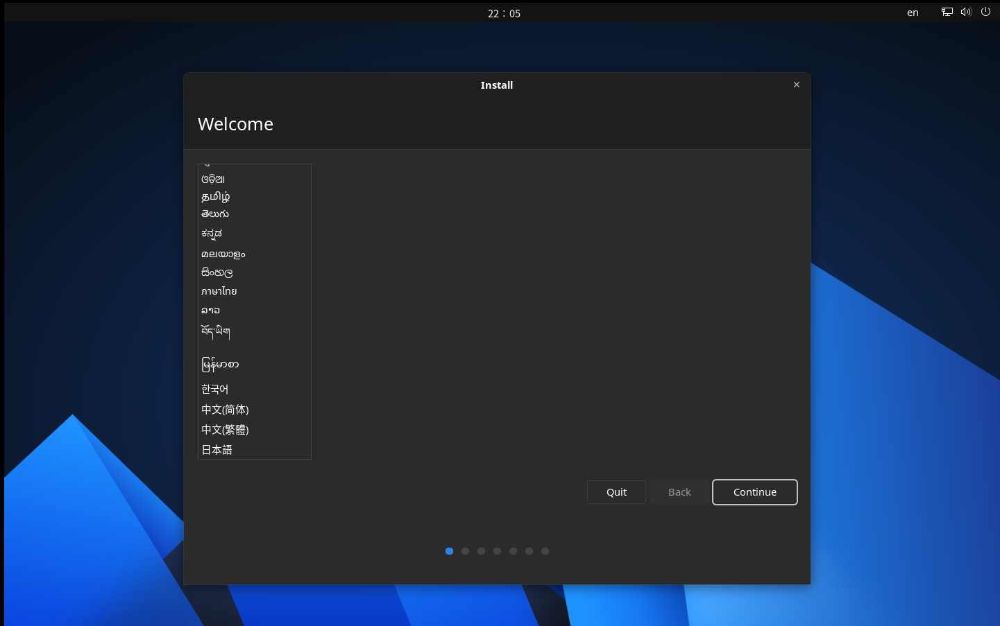

# Install AnduinOS from USB

After burning the AnduinOS ISO file to a USB drive, you can boot your computer from it to install AnduinOS.

!!! tip "Optional Pre-installation Steps"
    - **Secure Boot**: If you wish to use Secure Boot, please read the [Secure Boot Guide](./First-Boot-For-Secure-Boot.md) to enable it in your BIOS **before** booting the USB.
    - **NVMe Optimization**: If you are installing on an NVMe SSD, you may want to [Change the NVMe LBA Size to 4K](./Change-NVME-LBA-Size.md) for optimal performance.

## Boot from USB

The key to enter the boot devices menu varies depending on the manufacturer of your computer. Common keys include `F12`, `F11`, `Esc`, `F10`, or `Volume down + Power`.

1. Insert the USB drive and power on your computer.
2. Immediately press the boot menu key for your manufacturer.
3. Select the USB drive from the boot menu. 
4. In the GRUB menu, select your language and choose **Install AnduinOS**.

## Installation Process

The graphical installer will guide you through the setup:

1. **Select Language**: Choose the language you want to use during the installation process.
2. **Select Keyboard Layout**: Choose your keyboard layout.
3. **Updates and Other Software**: Choose whether you want to install updates and third-party software.
   * *Note: If Secure Boot is enabled, you will be asked to set a Secure Boot password here. Memorize this password! You will need it on your first boot to enroll third-party drivers.*
4. **Setup Disk**: Choose the disk where you want to install AnduinOS. You can also choose to encrypt the disk with LVM and LUKS2.
5. **Location**: Choose your location to set the time zone, locale formats, and APT sources.
6. **User Information**: Enter your name, username, and password for the new user account.
7. **Installation**: The installation process will begin.
8. **Complete**: Once finished, you will be prompted to restart your computer and remove the USB drive.

!!! info "Next Steps"
    If you enabled Secure Boot, you **must** complete the MOK enrollment on your first boot. Please follow the instructions in the [Secure Boot Guide](./First-Boot-For-Secure-Boot.md).
