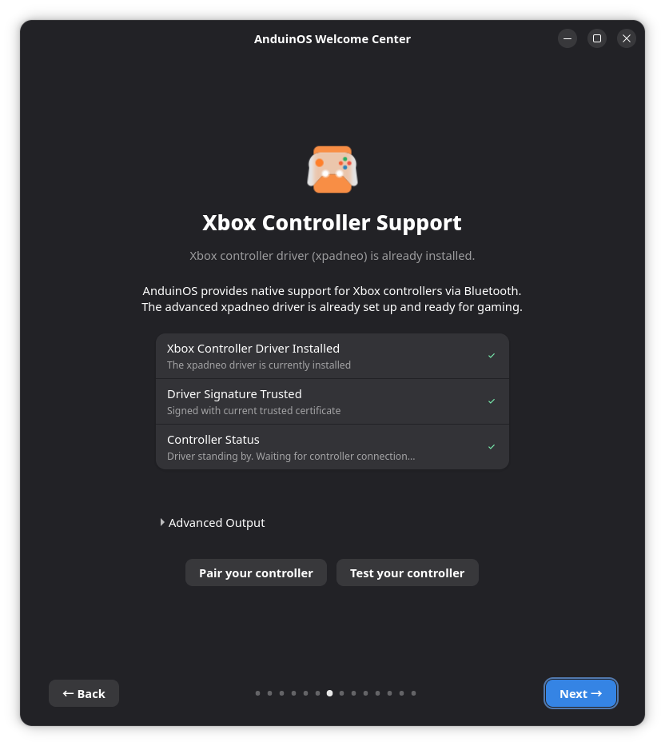

# Install Driver

After installing AnduinOS, hopefully all devices are functioning properly. However, if you find that some devices are not working as expected, you may need to install additional drivers. This guide will show you how to install drivers on AnduinOS.

!!! note "Non-open source drivers"

    Some drivers are not open source and may have licensing restrictions. Please make sure you have the right to use these drivers before installing them.

## (Recommended) Using AnduinOS Welcome Center

The easiest way to install missing hardware drivers (such as NVIDIA Graphics and Xbox Controllers) is via the built-in **AnduinOS Welcome Center**. The Welcome Center automatically detects your hardware and securely configures necessary drivers with proper module signing.

1. Open **Welcome Center** (AnduinOS OOBE) from your application menu.
2. Navigate through the setup to find dedicated pages for Graphics and Controllers.

For more detailed guides on specific drivers, see the sections below.

## Nvidia Graphics Driver

To install the Nvidia graphics driver, please follow the detailed [NVIDIA Drivers Installation Guide](./Install-Nvidia-Drivers.md).

## Intel Graphics Driver

Intel usually will merge latest drivers and packages to the Linux kernel. However, some modules, like `libva`, `vaapi`, `vulkan`, and `intel-media-driver`, may need to be installed separately.

To install the Intel graphics driver, you need to follow the [Intel Graphics Installer for Linux](https://dgpu-docs.intel.com/driver/client/overview.html) guide.

For example:

```bash title="install the intel-graphics PPA and the necessary compute and media packages"
# Please refer to the official Intel Graphics Installer for Linux guide for the latest instructions
sudo apt-get update

# Add the intel-graphics PPA
sudo add-apt-repository -y ppa:kobuk-team/intel-graphics

# Install the compute-related packages
sudo apt-get install -y libze-intel-gpu1 libze1 intel-ocloc intel-opencl-icd clinfo intel-gsc

# Install the media-related packages
sudo apt-get install -y intel-media-va-driver-non-free libmfx-gen1 libvpl2 libvpl-tools libva-glx2 va-driver-all vainfo
```

## Intel NPU Driver

For some models of Intel CPU including `MeteorLake`, `ArrowLake` and `LunarLake`, you may notice that the Intel NPU is not working. To enable the Intel NPU, you need to install the Intel NPU driver.

Please download and install the driver following [Intel NPU Driver Installation Guide](https://github.com/intel/linux-npu-driver/releases/latest).

After installing the driver, reboot your system, and you will see device: `/dev/accel/accel0`.

You need to set the render group for the device:

```bash title="Set the render group for the device"
# set the render group for accel device
sudo chown root:render /dev/accel/accel0
sudo chmod g+rw /dev/accel/accel0
# add user to the render group
sudo usermod -a -G render $USER
# user needs to restart the session to use the new group (log out and log in)
```

You can use the NPU to run some AI models, like `DeepSeek R1`. For more details about how to use NPU to deploy AI models, please refer to the [Blog](https://anduin.aiursoft.com/post/2025/2/3/deepseek-r1-32b-with-npu).

## Xbox Controller Driver

By default, AnduinOS supports Xbox controllers. However, you may encounter issues with the latest Xbox controllers, such as the Xbox Series X controller (e.g., incorrect `LT` or `RT` triggers response). In this case, you need to install the advanced `xpadneo` driver.

### (Recommended) Using AnduinOS Welcome Center

The easiest and safest way to install this driver—especially if you have **Secure Boot enabled**—is via the built-in Welcome Center, which automatically configures module signing for you:

1. Open **Welcome Center** (AnduinOS OOBE) from your application menu.
2. Navigate to the **Xbox Controller Support** page.
3. Click **Install Xbox Driver**.
4. Once completed, reboot your system. If you previously paired your controller, remove it from Bluetooth settings and re-pair it.



### (Alternative) Command Line Installation

If you prefer to install via the command line, you can install the `anduinos-xbox-controller-driver` package directly. 

!!! warning "Secure Boot Requirements"
    If you have Secure Boot enabled, ensure you have enrolled the AnduinOS system MOK (either via Welcome Center or MokManager). Ubuntu/AnduinOS configures DKMS automatically to sign modules using your system's MOK during the installation.

Run the following commands to install the driver:

```bash title="Install Xbox controller driver via APT"
sudo apt update
sudo apt install -y anduinos-xbox-controller-driver
```

After installation, reboot your system. If you have previously connected the Xbox controller, you need to remove it from your Bluetooth devices and re-pair it.

!!! note "How does driver signing work?"

    If you have Secure Boot enabled and want to understand how module signing, DKMS, and the OOBE repair buttons work, see the [Secure Boot Signing Architecture](./Secure-Boot-Signing-Architecture.md) reference.

## Build the Kernel

In case you bought very latest hardware, you may need to build the kernel from source to get the latest drivers. Please refer to the [Kernel Compilation](../Skills/Developing/Build-Your-Own-Kernel.md) guide for more information.
