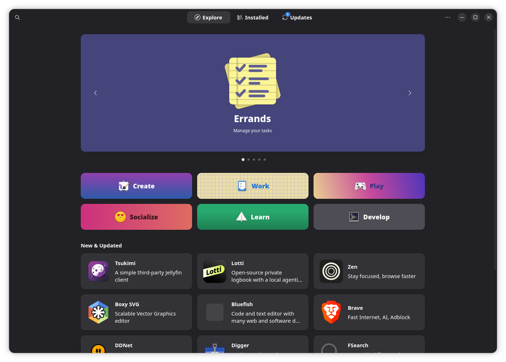
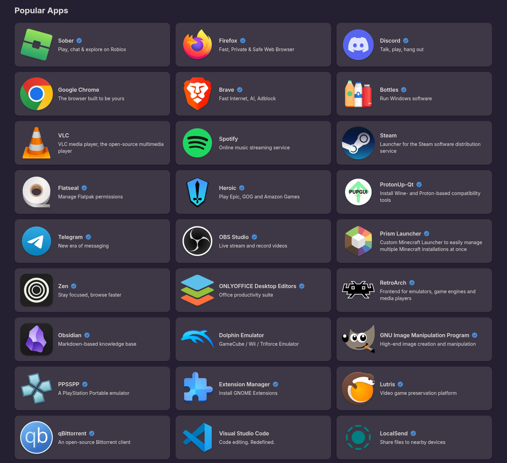

# Installing Applications

Unlike Windows, where you typically download installers from various websites, AnduinOS relies on a secure, centralized **App Store** model. This ensures that the software you install is verified, secure, and easy to update.

## The Software Center (Recommended)

The easiest and safest way to install applications is by using the built-in **Software** app.

1. Open the **Software** app from your app grid or by searching in the overview.
2. Browse through curated categories (Create, Work, Play, Socialize, Learn, Develop) or use the search icon in the top left corner to find a specific app.
3. Click the **Install** button. It's that simple!

### Flatpak: The Future of Linux Apps

When you browse the Software center, you will notice a section for **Popular Apps** containing familiar names like Firefox, Google Chrome, Discord, Spotify, and Steam.

Most of these applications are distributed as **Flatpaks**. Flatpak is a modern, universal packaging format for Linux. We highly recommend installing the Flatpak version of apps whenever possible because:

* **Security**: Flatpaks run inside a sandbox. They cannot access your system files or other apps without explicit permission. (You can manage these permissions using an app called **Flatseal**).
* **Up-to-date**: Flatpaks are bundled with their own dependencies, meaning you always get the latest version straight from the developer, completely independent of the underlying OS updates.
* **Clean System**: Because they are containerized, installing or removing Flatpaks will never leave messy dependencies behind or break your system.

## Advanced: Using the Terminal (APT)

While the Software center is perfect for everyday graphical applications, developers and power users may need to install command-line utilities, libraries, or system-level tools. For this, AnduinOS uses the advanced packaging tool (`apt`).

Open your terminal (`Ctrl + Alt + T`) and use the following commands:

* **To install a package**: `sudo apt install <package-name>`
* **To search for a package**: `apt search <keyword>`
* **To remove a package**: `sudo apt remove <package-name>`

## ⚠️ A Warning About `.deb` Files

If you search the web for Linux software, you might find websites offering `.deb` installer files. 

**Think twice before downloading and installing random `.deb` files.**

Unlike Flatpaks, `.deb` packages have root access to your entire system during installation. A poorly packaged `.deb` file can overwrite critical system libraries and completely break your OS (commonly known as "Dependency Hell").

Always check the **Software** app first. If the app is not available there, check if it has an official Flatpak on [Flathub](https://flathub.org). Only use `.deb` files as a last resort, and only if you completely trust the source (like Google, Microsoft, or official corporate vendors).
