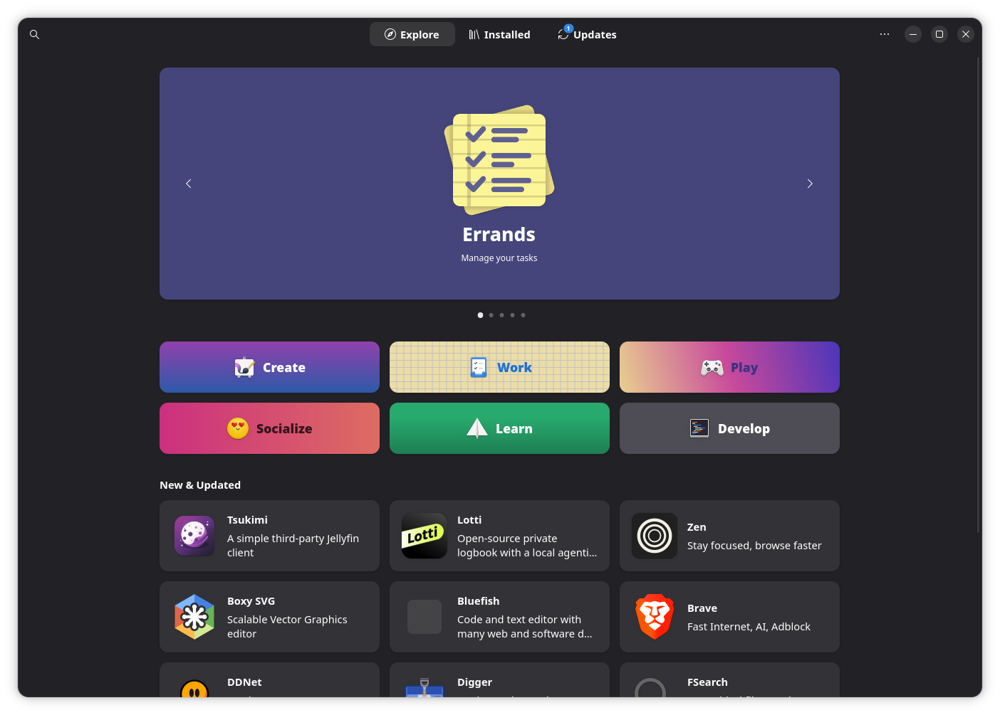
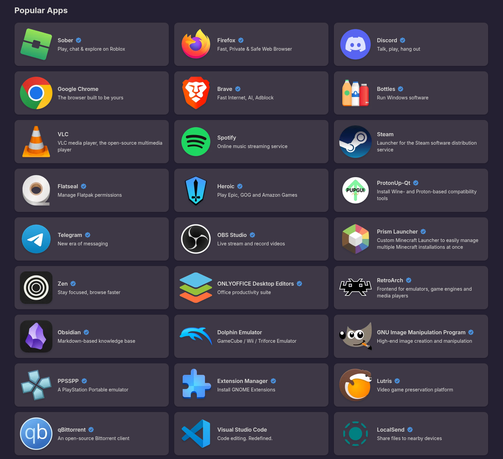
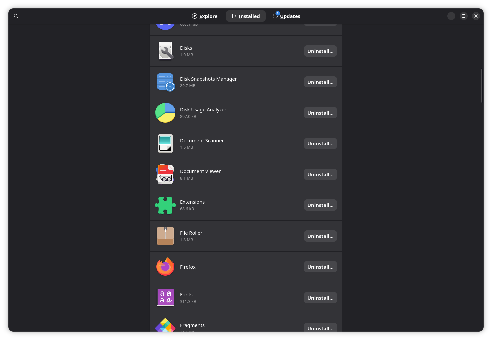
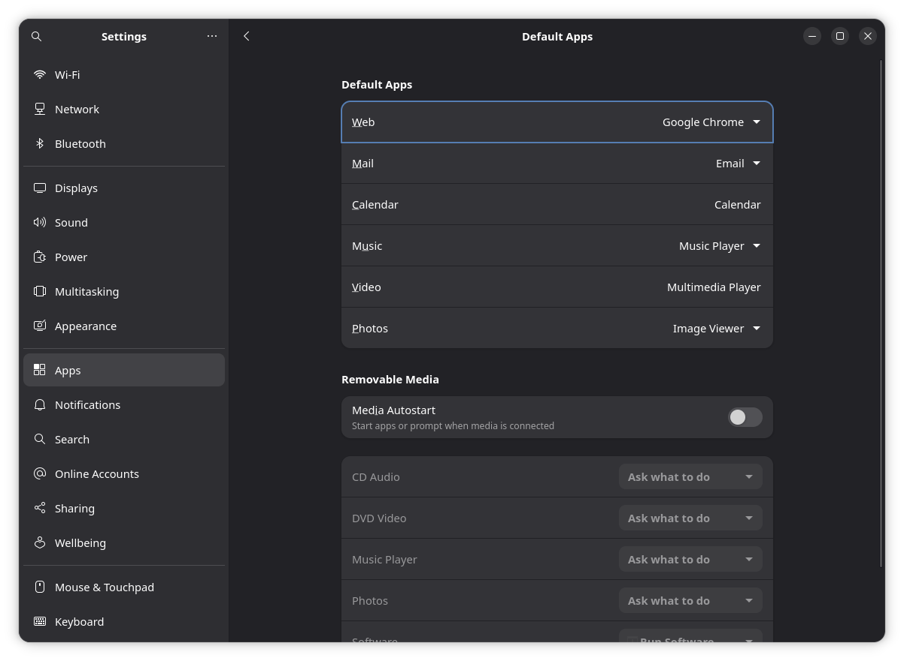

# Install, remove and choose default applications

AnduinOS supports graphical software installation, APT packages, Flatpak and standalone applications. Choose a source you trust and check that it supports your architecture and OS release.

## The Software Center (Recommended)

On AnduinOS 2, **Software** (also called **App Store**) is GNOME Software. The `anduinos-appstore` metapackage supplies the store and Flatpak integration; it is not a separate proprietary application catalog.

{ width=840 }

1. Open the **Software** app from your app grid or by searching in the overview.
2. Browse through curated categories (Create, Work, Play, Socialize, Learn, Develop) or use the search icon in the top left corner to find a specific app.
3. Click the **Install** button. It's that simple!

### Flatpak: The Future of Linux Apps

When you browse the Software center, you will notice a section for **Popular Apps** containing familiar names like Firefox, Google Chrome, Discord, Spotify, and Steam.

{ width=678 }

Many desktop applications are available as **Flatpaks**. Review the selected source on the application page; an app can be available in more than one format.

Flatpak applications use a sandbox, but permissions differ between applications. Check requested access; a sandbox does not guarantee that software is trustworthy. Flatpak applications update separately from APT. Removing an application may leave its user data behind.

## The App Store is missing or finds no applications

First confirm Internet access and your configured [software source](./Select-Best-Apt-Source.md). On AnduinOS 2, install the store components with:

```bash
sudo apt update
sudo apt install anduinos-appstore gnome-software gnome-software-plugin-flatpak flatpak
```

Sign out and back in if newly installed Flatpak applications do not appear in the application menu. Run `flatpak remotes` to check configured Flatpak sources; follow the [Flathub guide](../Applications/Store/Flathub/Flathub.md) if no suitable source is present. A store installation can succeed while its remote setup fails because the network was unavailable.

## Add extended multimedia format support

AnduinOS includes the codecs needed for common desktop playback. During a new online installation, the installer can optionally add a wider collection of GStreamer and FFmpeg codecs for legacy and specialist formats.

If you skipped that installer option, installed offline, or upgraded an existing system, install the same bundle later with:

```bash title="Install extended multimedia codecs"
sudo apt update
sudo apt install anduinos-multimedia-codecs
```

This metapackage installs `gstreamer1.0-plugins-bad`, `gstreamer1.0-plugins-ugly`, `gstreamer1.0-libav`, and `libavcodec-extra`. Codec availability does not override patent, copyright, or distribution restrictions that may apply in your jurisdiction.

## Advanced: Using the Terminal (APT)

While the Software center is perfect for everyday graphical applications, developers and power users may need to install command-line utilities, libraries, or system-level tools. For this, AnduinOS uses the advanced packaging tool (`apt`).

Open your terminal (`Ctrl + Alt + T`) and use the following commands, replacing `package-name` with the actual package name and `keyword` with your search term:

* **To install a package**: `sudo apt install package-name`
* **To search for a package**: `apt search keyword`
* **To remove a package**: `sudo apt remove package-name`

## I downloaded a .deb file. How do I install it?

Use the application's official source and verify its architecture and release compatibility. Open a terminal in the download folder and replace the example filename:

```bash
sudo apt install ./example.deb
```

The `./` identifies a local file. APT can resolve dependencies from configured repositories. Review the installation proposal rather than forcing incompatible packages. Installation can run privileged scripts, so a downloaded package needs the same trust as an administrator action.

If the vendor provides no update repository, a local `.deb` may need future manual updates. Prefer the existing store/repository version when appropriate.

## Run an AppImage

Download the build matching your CPU architecture from a trusted publisher, keep it in a stable location such as `~/Applications`, and make it executable. Replace the sample filename with the actual download:

```bash
chmod u+x Example.AppImage
./Example.AppImage
```

Run it as your normal user. Do not add `sudo` to work around a failure. See [AppImage's running guide](https://docs.appimage.org/user-guide/run-appimages.html).

If it fails, launch from a terminal to read the error. An architecture mismatch, missing FUSE library and an application bug require different fixes. AnduinOS 2 includes compatibility support for common AppImages, but this does not guarantee every downloaded build works. Do not replace core FUSE packages blindly.

For a menu or desktop entry, follow [Manage App Icons](../Skills/System-Management/Manage-App-Icons.md) and point the launcher at the file's stable absolute path. Moving the AppImage later breaks that launcher. Updating normally follows the publisher's instructions rather than `apt upgrade`.

## Remove or uninstall an application

In Software, open **Installed** and find the application. Click its **Uninstall…** button, or open its details and choose **Uninstall** if your version puts the action there.

{ width=840 }

The **Installed** tab is selected at the top. Each visible application has its own **Uninstall…** button on the right; match the button to the intended application before proceeding. This view does not show the application source. If an application is not listed, identify how it was installed:

| Installation method | Removal |
| --- | --- |
| APT or local `.deb` | `sudo apt remove package-name` after identifying the actual package name |
| Flatpak | Use `flatpak list --app` to find its ID, then `flatpak uninstall app.id` in the same user/system installation |
| AppImage | Close it, delete its file and remove any launcher you created |
| Snap | Follow the [Snap guide](../Applications/Store/Snap-Store/Snap-Store.md) and identify the snap before removing it |

Review proposed removals. Stop if removing one application would unexpectedly remove the desktop. These actions do not necessarily remove personal documents, profiles or saved settings. Keep application data if you intend to reinstall; do not delete broad configuration directories to remove a single application.

## Change the default browser or app for a file type

Open **Settings → Apps** and find the default-application controls, or search Settings for **Default Apps** if the layout differs on your release. See [GNOME default browser settings](https://help.gnome.org/gnome-help/net-default-browser.html). Select an installed browser or other default application.

Choose the **Web** dropdown at the top of **Default Apps** to change the default browser. It currently shows **Google Chrome** in the example. The rows below select defaults for mail, calendar, music, video and photos.

{ width=840 }

The **Removable Media → Media Autostart** switch lower down controls what happens when media is connected. For applications that should open after login, use [startup application settings](./Startup-Applications.md).

For a specific file type, right-click a representative file in the file manager, open its **Properties/Open With** controls and choose the default handler. Changing the default does not uninstall the previous application. If the app is not offered, open it once and check that its desktop launcher declares support for that file type.

If a website's desktop shortcut or a file still opens the old app, check that shortcut separately: it may explicitly name a browser instead of using the default.

For Windows `.exe` files, see [Run Windows applications](../Skills/Sandboxing/Run-Windows-Apps.md). For APK files, see the [Android compatibility FAQ](./Compatibility-FAQ.md).
