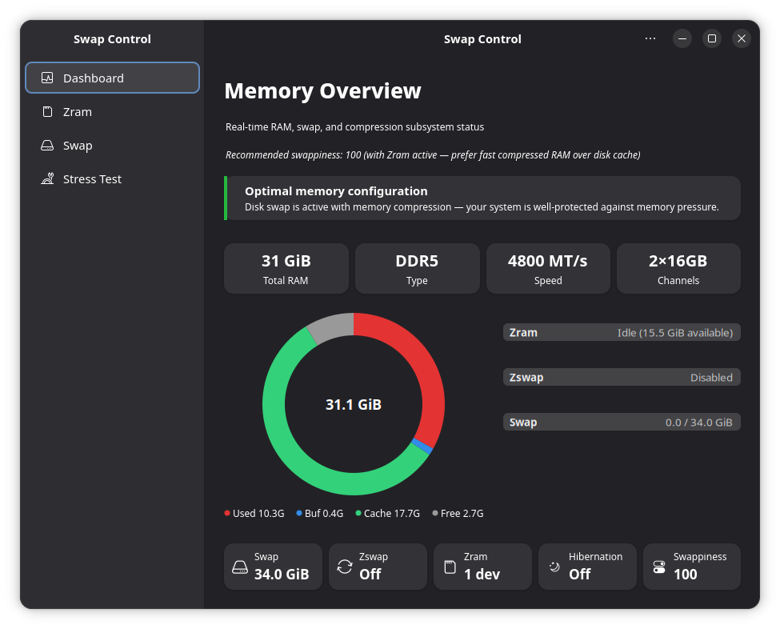
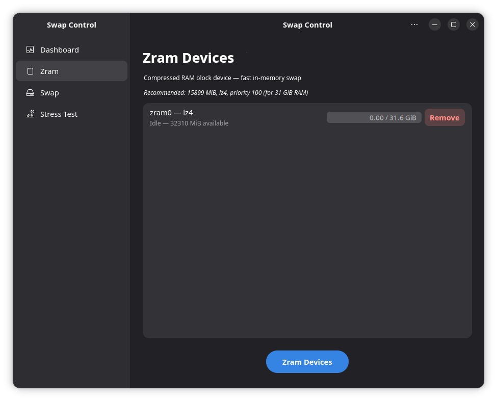
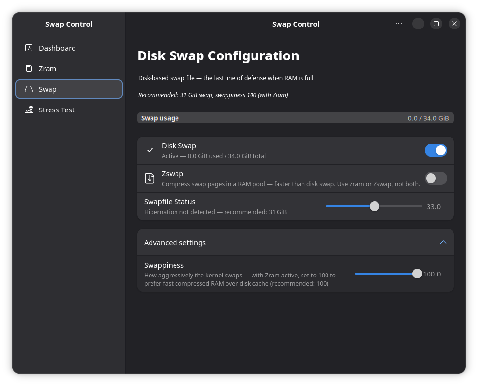

# Manage Swap

Swap is space that the kernel uses when physical RAM is full — inactive memory pages are moved to swap so that active applications can stay in RAM.

AnduinOS ships with **Zram enabled by default**: a compressed swap device that lives in RAM itself, using the fast LZ4 algorithm. On a fresh install you already have working swap — no manual setup is needed.

## Manage swap with the GUI

The recommended way to configure swap on AnduinOS is the **Swap Control** application. *(Added in AnduinOS 2.0.1)* It provides a comprehensive graphical interface for your virtual memory.

1. Open your application menu and search for **Swap Control**.
2. Alternatively, launch it from the terminal:

```bash title="Launch Swap Control GUI"
swapcontrol-gtk
```

### Dashboard (Memory Overview)

The Dashboard provides a real-time overview of your system's memory pressure, showing exactly how much RAM is occupied by cache versus active applications, and the status of your compression subsystem.



### Zram & Zswap Configuration

Navigate to the **Zram** and **Swap** tabs to precisely tune your setup:
* **Zram Devices**: Configure the size and compression algorithm (like `lz4` or `zstd`) for your in-memory swap.
* **Disk Swap**: Enable or disable the physical swap file.
* **Swappiness**: Adjust how aggressively the kernel swaps out memory (default is 100 to fully utilize Zram).




All changes made in the graphical interface are applied immediately and survive reboots.

## Check your current swap

```bash title="See active swap devices"
swapon --show
```

```bash title="Memory and swap overview"
free -h
```

If you see `/dev/zram0` in the output, Zram is active. If you also see `/swapfile`, you have an on-disk swap file as a secondary fallback.

## When to disable swap

For most workloads, you should keep swap enabled — the Zram default is designed to improve desktop responsiveness. However, some scenarios call for disabling it:

* **Distributed databases** (e.g. Cassandra, Elasticsearch nodes) where the database engine manages its own memory and OS swap causes unpredictable latency
* **Kubernetes nodes** where the kubelet requires swap to be off
* **Embedded systems** with severe storage constraints

To disable all swap immediately:

```bash title="Disable all swap"
sudo swapoff -a
```

!!! warning "This is temporary"
    Swap devices will return at the next reboot unless you also disable them permanently. Use the **Swap Control** GUI to make permanent changes, or disable the relevant systemd service (`anduinos-zram.service` for Zram).

---

## Architecture at a Glance

The **Swap Control** GUI is a declarative configuration editor. It does not execute complex system commands directly; instead, it safely writes your choices to standard configuration files (`/etc/default/anduinos-zram` and `/etc/default/anduinos-zswap`) and restarts the backend systemd services. 

On a fresh installation, these configuration files are completely empty, and the system seamlessly falls back to the highly optimized **AnduinOS Factory Defaults**:

* **Zram**: Enabled at **50%** of total physical RAM.
* **Compression**: Fast **LZ4** algorithm.
* **Zswap**: Disabled (to prevent redundant compression).
* **Swappiness (`vm.swappiness`)**: **100** (Prefers compressing idle memory into fast Zram rather than dropping useful file cache).
* **Page Cluster (`vm.page-cluster`)**: **0** (Disables swap read-ahead, which is unnecessary for zero-latency RAM).

!!! tip "Want to understand the architecture?"
    For a deep dive into the declarative backend, the five-layer swappiness priority system, manual tuning via `sysctl.d`, and what happens when packages are removed, see the **[Swap Control Strategy](../Skills/System-Management/Swap-Control-Strategy.md)** advanced article.
