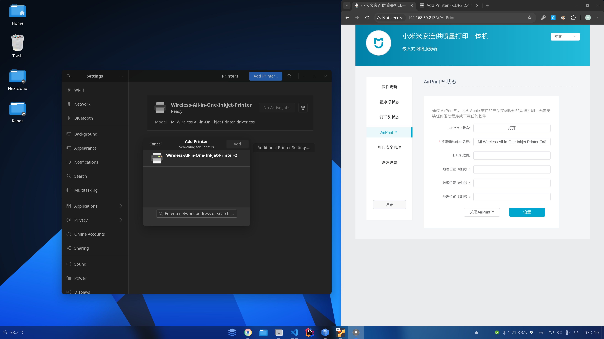

# Managing Printers

In the past, setting up a printer on Linux was a nightmare of finding the right drivers. Today, AnduinOS supports **Driverless Printing** (via IPP Everywhere and Apple AirPrint) out of the box. 

The CUPS printing system is **pre-installed**, meaning most modern printers will work the moment you plug them in via USB or connect them to the same Wi-Fi network.

## 1. Prepare your Printer

Make sure your printer is turned on and connected to the same local network as your computer (or plugged in via USB).

If your printer is connected to Wi-Fi but AnduinOS cannot find it, you may need to log into your printer's admin panel (via its IP address on your phone or computer) and ensure that **AirPrint**, **IPP**, or **Mopria** services are enabled.

For example, on a Xiaomi network printer, you must explicitly enable the AirPrint service in its settings:



## 2. Add the Printer via Settings

You do not need to use the terminal or archaic web interfaces to add a printer.

1. Open your application menu and launch **Settings**.
2. Navigate to the **Printers** tab.
3. Click the **Add Printer...** button.
4. AnduinOS will scan your local network and USB ports. Once your printer appears in the list, simply click on it.

The system will automatically configure it using driverless protocols. You are now ready to print!

---

## Troubleshooting

### Legacy HP Printers

Modern HP printers work flawlessly via the driverless method above. However, if you have a very old HP printer (e.g., from 10+ years ago) that relies on proprietary USB drivers, you can install the HP Linux Imaging and Printing (HPLIP) tool:

```bash title="Install HPLIP for Legacy HP Printers"
sudo apt update
sudo apt install hplip
hp-setup
```

*(Follow the interactive terminal prompts to configure your old printer).*

### Advanced CUPS Web Interface

If the GNOME Settings GUI fails to add your printer, or you need to configure advanced print server rules, you can access the underlying CUPS admin panel.
Open your web browser and navigate to: `http://localhost:631/admin`. You can log in using your normal AnduinOS username and password.
