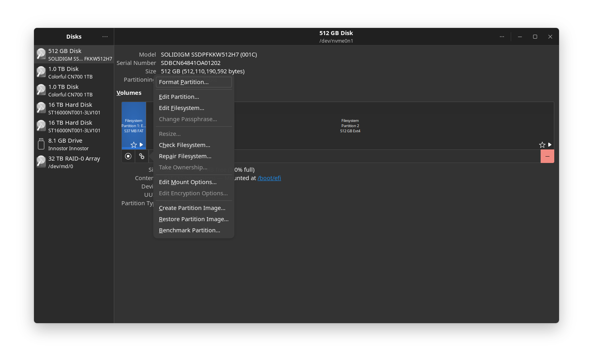

# Mount your second disk

# Mount your second disk

If you have a second disk in your computer, you can mount it to use as a dedicated storage drive (for games, media, or backups). 

## (Recommended) Mount via the Disks App

The safest and most user-friendly way to format and mount a new disk in AnduinOS is using the built-in **Disks** application.

1. Open your application menu and search for **Disks**.
2. On the left panel, select your second disk (make sure you don't select your system drive).
3. **(Optional) Format the disk:**
   If the disk is brand new or you want to wipe it:
   - Click the **three dots** (hamburger menu) in the top right and select **Format Disk...**
   - After formatting the drive, click the **+** button under the "Volumes" graph to create a new partition (e.g., Ext4).
4. **Configure Automatic Mounting:**
   - Select the newly created partition block.
   - Click the **Gear icon** (⚙️) below the partition map and select **Edit Mount Options...**



   - Toggle **User Session Defaults** to the **OFF** position.
   - Set your desired **Mount Point** (e.g., `/mnt/disk2` or `/opt/data`).
   - Click **OK** and enter your password.

The Disks app will safely write to your system's configuration file (`/etc/fstab`) using the disk's unique UUID. Your disk will now automatically mount to that folder every time you boot!

---

## (Alternative) Command Line Configuration

If you prefer the terminal or are managing a server, you can manually mount the disk.

!!! warning "Use UUIDs, not device names!"
    Device names like `/dev/sdb` or `/dev/nvme1n1` can change after a reboot. Always use the disk's UUID in `/etc/fstab` to ensure your system boots safely.

1. Find your disk and its UUID using `lsblk` and `blkid`:

```bash title="List block devices"
lsblk -f
```

Identify your second disk (e.g., `/dev/nvme1n1`). If it is not formatted, format it first:

```bash title="Format the disk (Destructive!)"
sudo mkfs.ext4 /dev/nvme1n1
```

2. Create the mount point directory:

```bash
sudo mkdir -p /opt/disk2
```

3. Find the UUID of your newly formatted disk:

```bash
sudo blkid /dev/nvme1n1
# Output example: /dev/nvme1n1: UUID="12345678-abcd-1234-abcd-123456789abc" TYPE="ext4"
```

4. Add the UUID to `/etc/fstab` to mount it automatically on boot:

```bash title="Edit /etc/fstab"
# Replace the UUID with the one you found in step 3
echo "UUID=12345678-abcd-1234-abcd-123456789abc /opt/disk2 ext4 defaults 0 0" | sudo tee -a /etc/fstab
```

5. Test the mount configuration without rebooting:

```bash
sudo mount -a
df -Th
```

If the `df -Th` command shows your disk mounted at `/opt/disk2`, you have successfully configured your second disk!
