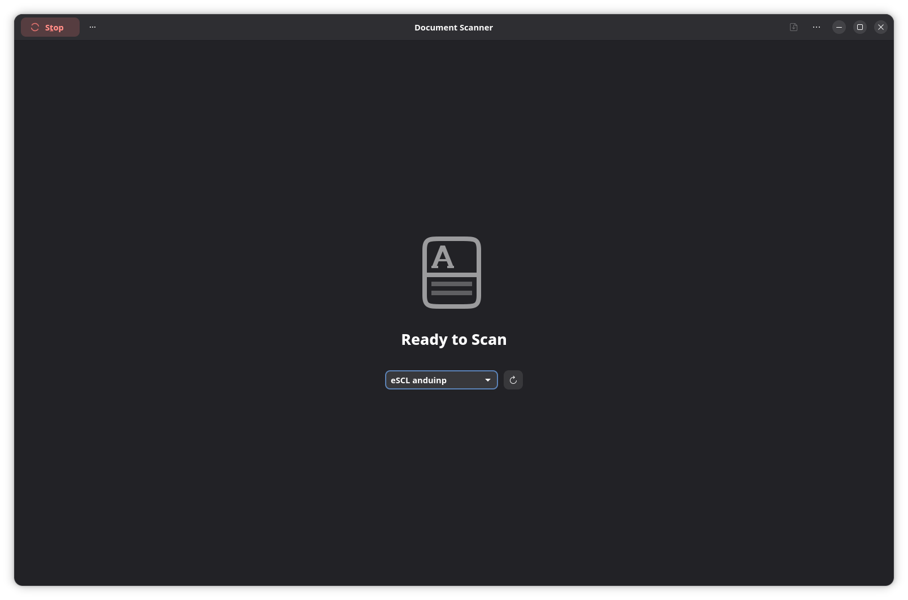
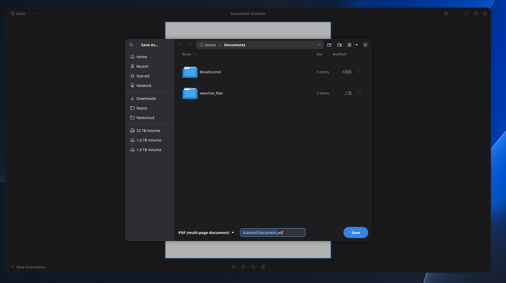

# Scan documents and save them as PDF

AnduinOS desktop packages recommend **Document Scanner** (`simple-scan`). Printing and scanning are separate functions: a printer working through IPP does not prove its scanner is supported.

## Select your scanner

Connect a USB scanner directly, or put the network scanner on the same local network as the computer. Turn it on and finish any device setup. Open **Document Scanner** from the application menu. If absent, install it through Software or run `sudo apt install simple-scan`.

Use the device dropdown beneath **Ready to Scan** to select your scanner. The adjacent circular-arrow button refreshes device discovery.

{ width=840 }

An eSCL device is selected in this example. No scanned page is displayed yet, and the toolbar currently shows **Stop**; this is not a completed scan.

## Scan and check the pages

Place a test page on the scanner or in its feeder. Choose the text/photo and page-source options available for your device, then use **Scan** when the application is ready. Wait for the page preview; use **Stop** if you need to cancel the operation. Inspect the preview, add further pages, and rotate or crop them as needed before saving.

## Save the scanned pages as a PDF

After scanning, use the save action to open **Save As…**:

1. Select a destination folder using the sidebar or path bar. The example uses **Home / Documents**.
2. At the bottom left, choose **PDF (multi-page document)**.
3. Enter a filename in the field beside it; the example uses **Scanned Document.pdf**.
4. Click **Save** at the bottom right, then open the saved PDF and check every page.

{ width=840 }

The save dialog covers most of the preview in this example. Close the dialog to inspect, rotate or reorder scanned pages before exporting if needed.

## Is my Canon 4400F or older scanner supported?

Check the exact model and USB device ID against the [SANE supported devices list](https://www.sane-project.org/sane-mfgs.html). Similar model names may use different hardware. Network scanners may use eSCL/AirScan, while older USB scanners need a model-specific backend and sometimes firmware. A generic printer-driver package does not establish scanner support.

## Scanner not found or scanning fails

Close other scanning programs, reconnect USB without a hub, and test the same device on another computer if possible. For a network device, check its address and scanning-service settings. Discovery across guest Wi-Fi or separate network segments may be blocked even when Internet access works.

Use [printing and scanning troubleshooting](./Troubleshoot-Printing-and-Scanning.md) to collect device IDs and backend detection results. Do not install an unrelated driver solely because its brand matches your scanner.
