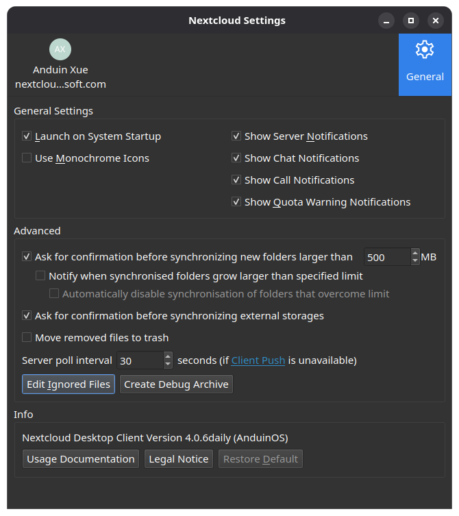

# Start an application automatically after login

Desktop autostart launches applications after you sign in. It does not start a server before login or replace a system service.

## Use the application's own preference first

In the Nextcloud desktop client, open **Settings**, select **General** on the right, and check **Launch on System Startup** under **General Settings**. The box is already checked in the screenshot. Uncheck it to stop the client opening automatically after login.

{ width=551 }

Other applications may call this **Start at login** or **Launch on startup**. After changing it, sign out and back in to test that only one copy opens. Avoid adding a second autostart entry for the same application. This setting starts the desktop client with your session, not a Nextcloud server.

## Add a desktop autostart entry

For an application without that option, use its existing `.desktop` launcher. In Files, find the application's launcher in `/usr/share/applications` or `~/.local/share/applications`. Flatpak launchers may be under `~/.local/share/flatpak/exports/share/applications` or `/var/lib/flatpak/exports/share/applications`.

Copy the trusted launcher into `~/.config/autostart`, creating that folder if necessary. Keep its filename and application command. These paths assume the usual XDG directory defaults. Test the application manually first and then test a new login. Do not copy a web-downloaded launcher without reviewing what it executes.

This uses the [desktop autostart specification](https://specifications.freedesktop.org/autostart/latest/).

## Disable or remove startup applications

Turn off the application's own preference if it created the entry. For an entry you copied yourself, remove that copy from your personal autostart folder; this does not uninstall the application.

To override a system entry in `/etc/xdg/autostart`, copy it to your personal autostart folder with the **same filename** and set `Hidden=true` in its `[Desktop Entry]` section. Remove that override to restore the system behavior. Leave authentication, keyring and desktop services enabled unless you understand their role.

## The application does not start, or starts twice

Check that the executable still exists and the launcher opens normally. Inspect `Hidden`, `TryExec`, `OnlyShowIn` and `NotShowIn` in the entry. Keep only one startup mechanism. A GUI that requires network access may open before connectivity is ready; use the application's reconnect behavior rather than inserting an arbitrary long delay. For failures, inspect `journalctl --user -b` around the login time.
