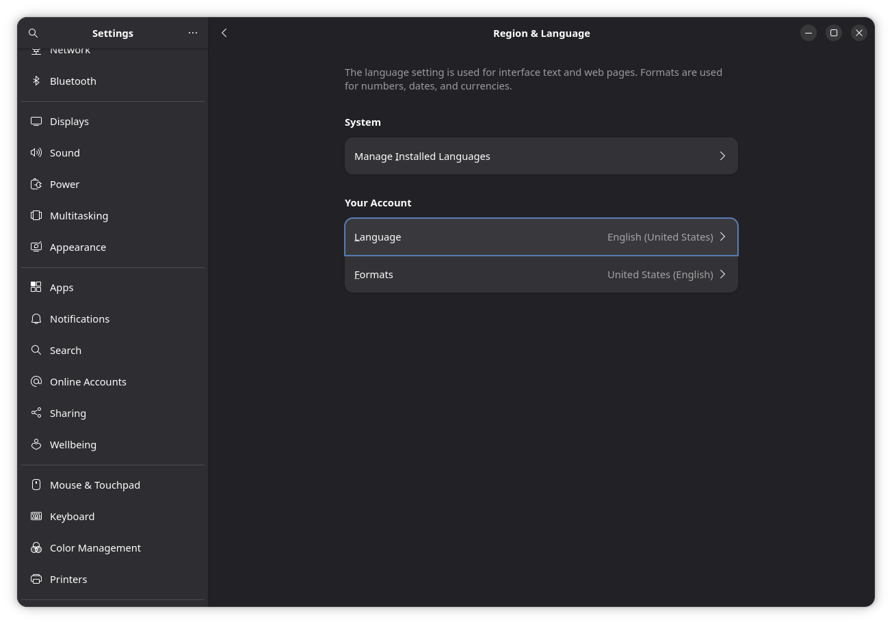
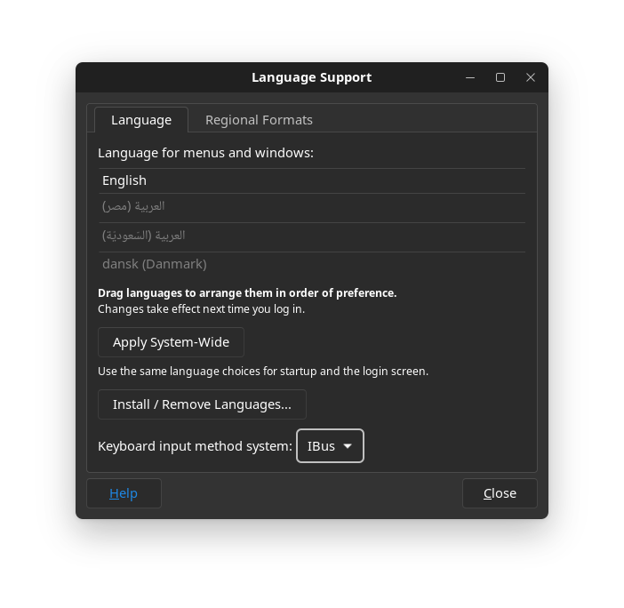
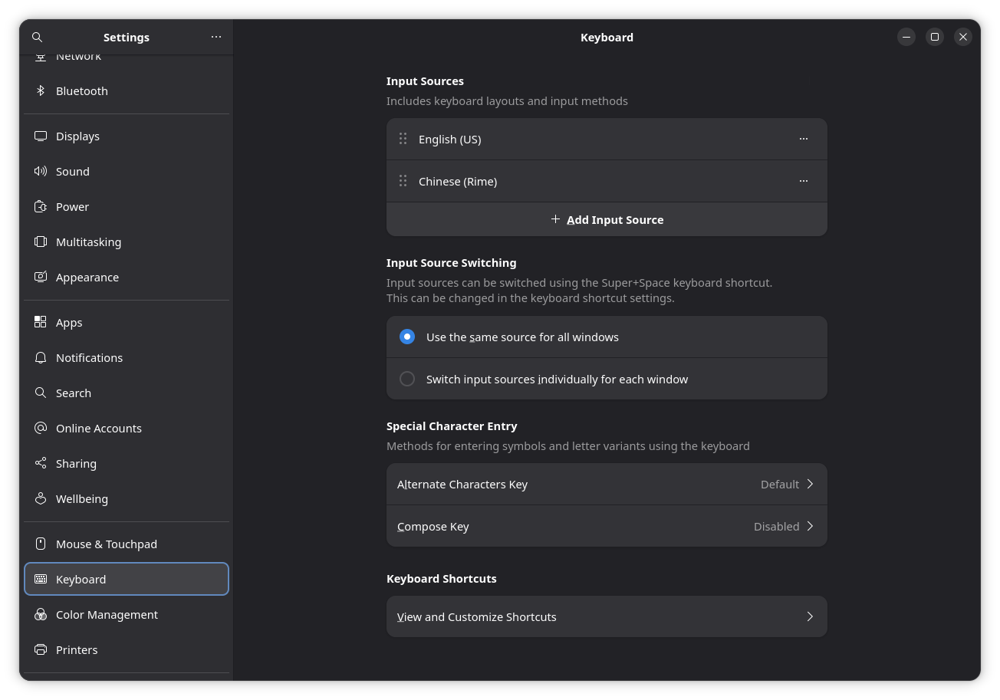

# Switch to your language

If you installed AnduinOS in English but prefer to use a different language (like Japanese or Chinese), you can easily switch your system language, regional formats, and input methods.

## (Recommended) Change Language via Settings

AnduinOS handles language packs and input methods automatically through the graphical settings. You do not need to manually install packages from the terminal.

### Step 1: Install Language Packs
1. Open your application menu and launch **Settings**.
2. Navigate to **Region & Language** on the left sidebar.



3. Click **Manage Installed Languages**. This will open the Language Support window.
4. Click **Install / Remove Languages...**, check your desired language (e.g., Chinese or Japanese), and click Apply. The system will automatically download all necessary translations, fonts, and dictionaries.



### Step 2: Switch the UI Language
1. Go back to the **Region & Language** settings panel.
2. Under "Your Account", click **Language** and select your newly installed language from the list.
3. (Optional) Click **Formats** to change how dates, numbers, and currencies are displayed to match your region.
4. A prompt will appear asking you to **Restart Session**. Log out and log back in for the new language to take effect.

### Step 3: Add an Input Method (Keyboard)
If you need to type in a language with complex characters (like Chinese Pinyin or Japanese Romaji), you need to add an input source.

1. Open **Settings** and navigate to **Keyboard**.
2. Under "Input Sources", click **Add Input Source**.
3. Search for your language. For example, search for **Chinese (Rime)** or **Japanese (Anthy)**.
   *(Note: AnduinOS pre-installs the excellent Rime engine for Chinese users).*



You can now use the <kbd>Super</kbd> + <kbd>Space</kbd> shortcut to toggle between English and your new input method.

---

## (Alternative) Command Line Setup

If you prefer managing your system via the terminal, you can configure your locale and install language packs using standard commands.

!!! warning "Do not edit `~/.pam_environment`"
    Older guides may tell you to edit `~/.pam_environment`. This feature has been permanently removed from modern Linux systems for security reasons. Use `localectl` instead.

### 1. Install Language Packs
```bash title="Install Chinese language packs"
sudo apt update
sudo apt install language-pack-zh-hans language-pack-gnome-zh-hans
```

### 2. Set System Locale
Use the `localectl` command, which safely writes to the system configuration:
```bash title="Set locale to Simplified Chinese"
localectl set-locale LANG=zh_CN.UTF-8
```
*You must log out and log back in for the locale change to take effect.*

### 3. Switch Timezone
If your system clock is incorrect, you can change your timezone from the command line:
```bash title="Set timezone to Shanghai"
sudo timedatectl set-timezone Asia/Shanghai
```
*(To view all available timezones, use `timedatectl list-timezones`).*
