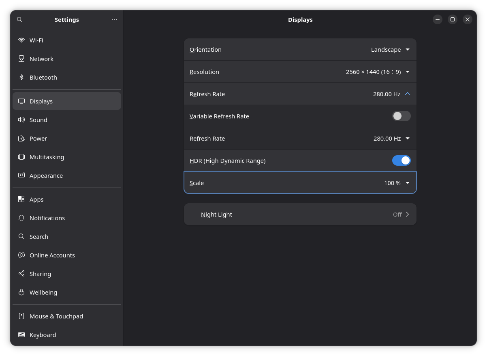
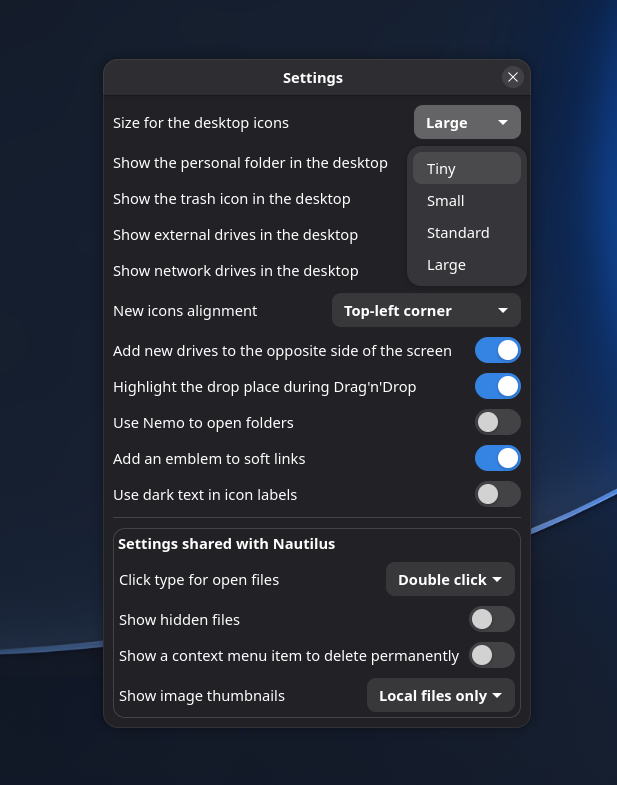

# Make text and icons larger; adjust display scaling

Use this guide when text is too small, desktop icons are too large, or an external monitor uses the wrong size or refresh rate. The controls below affect different parts of the desktop.

## Make everything larger with display scaling

Open **Settings → Displays**, select the display, and choose **Scale**. Apply the change and confirm only if the result is usable. If the display becomes unreadable, wait for the confirmation timeout to revert it. Configure each display separately where supported.

{ width=840 }

The example shows **Scale: 100%** and **Resolution: 2560 × 1440**. Use the **Scale** dropdown near the bottom to enlarge the interface. **Refresh Rate** is expanded above it; the pictured 280 Hz and HDR support belong to this monitor, not a setting every computer should use.

See [GNOME display settings](https://help.gnome.org/gnome-help/look-resolution.html) for the apply-and-confirm flow. Use the monitor's native resolution when possible. Reducing resolution also enlarges content, but can make it less sharp. Fractional scale choices depend on the desktop version and hardware. For blurry Chrome content, see the [Chrome guide](../Applications/Web-Browsers/Google-Chrome/Google-Chrome.md).

## Enlarge text without changing the whole display

Open **Settings → Accessibility → Seeing** and enable **Large Text**. Application-specific zoom, such as a browser's zoom menu, changes that application only. To change fonts more precisely, GNOME Tweaks may provide additional controls; install `gnome-tweaks` from the configured APT repositories if needed.

To install a downloaded font for your user, open its file in Font Viewer and choose **Install**, then restart applications that should use it. A font being installed does not automatically select it in every application.

## Change desktop icon size

Desktop icons are managed by Desktop Icons NG (DING). Open **Extensions**, locate **Desktop Icons NG**, and open its preferences to choose the icon size. You can also open its preferences from a terminal:

```bash
gnome-extensions prefs ding@rastersoft.com
```

Open the **Size for the desktop icons** dropdown at the top. Choose **Tiny**, **Small**, **Standard** or **Large** to adjust desktop icons.

{ width=487 }

The current value is **Large**; the open menu shows the available choices. The **Show the personal folder**, **Show the trash icon** and drive switches below control which icons appear.

If the extension is missing, check `gnome-extensions list` and your installed desktop version. If desktop icons are hidden, enable **Show Desktop Icons** in AnduinOS Appearance first. The desktop right-click settings entry may open AnduinOS Appearance instead of DING's detailed preferences.

File-manager zoom changes icons in that file-manager window, not desktop icons. Taskbar sizing belongs to the taskbar extension's preferences, accessible through AnduinOS Appearance's advanced controls.

## Refresh rate and multiple monitors

In **Settings → Displays**, select a monitor and choose its resolution and refresh rate. Arrange monitor rectangles to match the physical desk. If a desired mode is absent, check the monitor, cable and dock capabilities before changing drivers. See [display troubleshooting](./Troubleshoot-Displays-and-Desktop.md) for black screens or freezes.
