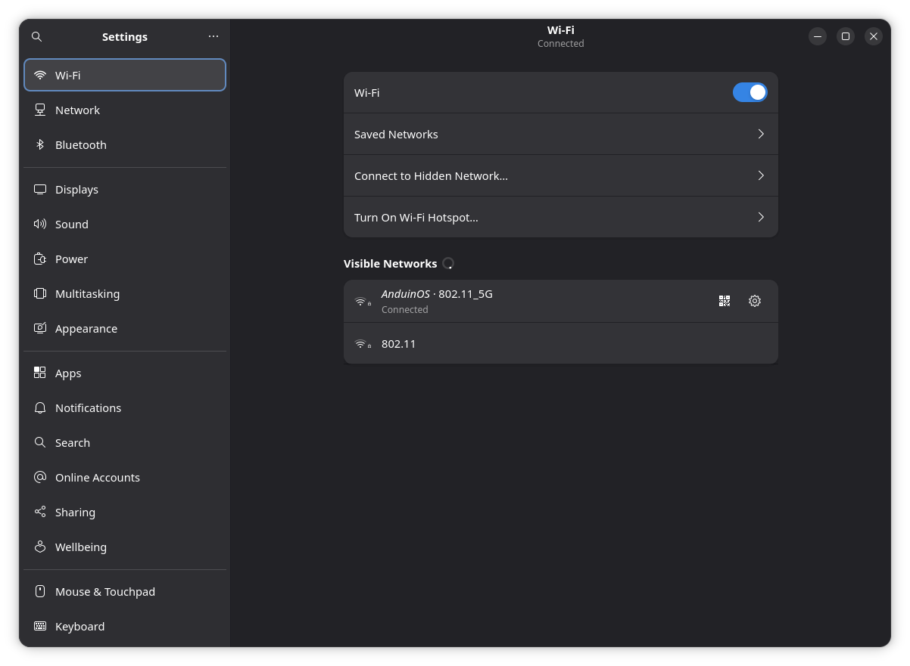
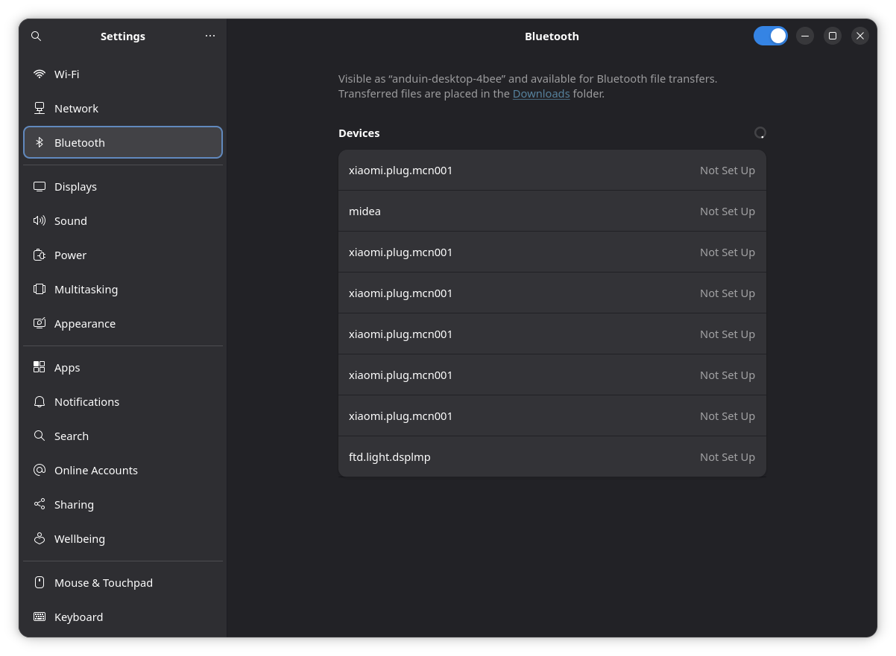

# Wi-Fi missing or Bluetooth keeps disconnecting

## Confirm the version and symptom

Record your [system version](./Troubleshooting.md), adapter model and whether the problem began after an update or suspend. Distinguish a missing adapter, a connection failure, and a connected network without Internet access.

## Simple checks

Turn off airplane mode and check any physical wireless switch. Open **Settings → Wi-Fi** or **Bluetooth** and enable the device. Test near the router or paired device. For USB adapters, try a direct port instead of a hub. Check whether another device can use the same network.

{ width=840 }

The blue **Wi-Fi** switch is on. Under **Visible Networks**, **Connected** marks the network in use; the other listed network is merely available. Open the gear button on the connected row to inspect its settings. Being connected to Wi-Fi does not by itself establish Internet access.

For Bluetooth, charge the peripheral and disconnect it from other hosts. Remove and pair that device again only when you can put it into pairing mode. Keep a wired input device available before removing a Bluetooth keyboard or mouse.

{ width=840 }

The blue switch in the title bar enables Bluetooth. Every listed device in this example says **Not Set Up**: discovery is working, but these entries do not show a completed pairing or connection. Put your intended peripheral into pairing mode, select its entry and follow the prompts. Device names vary, so do not select an unfamiliar nearby device just because it appears.

## Collect diagnostic information

```bash
nmcli device status
nmcli radio
rfkill list
lspci -nnk
lsusb
journalctl -b -u NetworkManager --since '-10 minutes'
journalctl -b -u bluetooth --since '-10 minutes'
```

The PCI/USB device ID distinguishes different Realtek or other chipsets sold under similar product names. `rfkill` distinguishes a software block from a hardware block. For firmware errors, inspect `journalctl -b -k` around device initialization. If a diagnostic command is absent, install its package only after connectivity is available, or include that limitation in your help request.

## Choose the next step

- **Software blocked:** enable the radio in Settings. `rfkill unblock wifi` or `rfkill unblock bluetooth` can clear the corresponding software block. A hardware block requires the physical switch or firmware setting.
- **Adapter detected but no driver/firmware:** identify the exact device ID and missing firmware filename. Use an Ethernet connection or supported temporary adapter to apply [system updates](./Update-Your-System.md), then reboot and retest. Follow [Driver Center](../Applications/System/Driver-Center/Driver-Center.md) for supported actions; do not assume it offers a driver for every wireless chipset.
- **Password or authentication failure:** verify the network name and credentials. Forget only that connection and reconnect if you have its credentials. Enterprise Wi-Fi may require organization-specific certificates and settings.
- **Connected but no Internet:** check the router and captive portal. `ip route` shows the gateway, and `resolvectl status` shows DNS configuration. Compare another device before changing DNS or disabling security settings.
- **Only fails after suspend:** use [sleep diagnostics](../Skills/System-Management/Diagnose-Sleep.md), retaining the kernel log around the wake event.

## When to ask for help

Seek help if the adapter remains absent or kernel logs show repeated firmware/driver errors. Include device IDs, kernel version, radio-block status and results from another network or Live USB. For an Xbox controller, use the [specific driver guide](./Install-Drivers.md) rather than treating all Bluetooth devices as requiring xpadneo.
