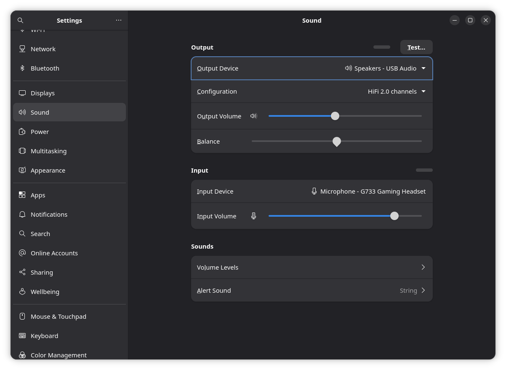
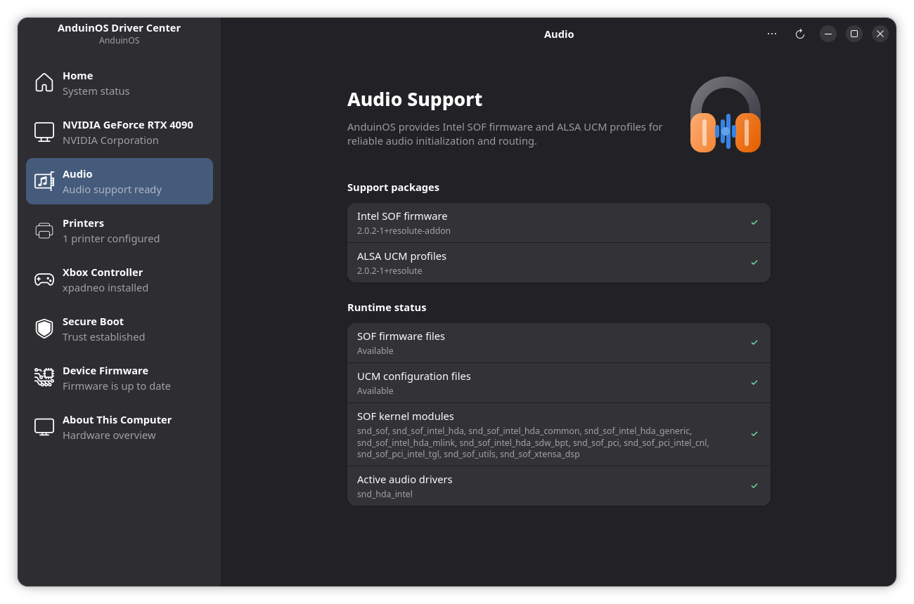

# No sound, Dummy Output or microphone not working

## Confirm the version and symptom

Record the [system version](./Troubleshooting.md), whether you use built-in speakers, HDMI, USB or Bluetooth audio, and whether the problem affects every application. AnduinOS 2 desktop packages use PipeWire, its PulseAudio compatibility service and WirePlumber.

## Simple checks

Open **Settings → Sound**. Under **Output**, choose **Output Device**, adjust **Output Volume**, and use **Test…** at the upper right. Under **Input**, choose your microphone and adjust **Input Volume**. Check the physical mute switch and whether the input meter responds when you speak.

{ width=840 }

The example plays through **Speakers - USB Audio** and records through **Microphone - G733 Gaming Headset**. Playback and recording can use different devices. HDMI monitors can also become the selected output, so check the selected device rather than only raising the volume. If just one application fails, check its own device selection and microphone permission; browser site permissions are separate.

Disconnect and reconnect a USB headset. For Bluetooth, compare a wired headset: microphone use can change the available Bluetooth audio profile and playback quality.

## Collect diagnostic information

Run these as your desktop user, without `sudo`:

```bash
wpctl status
systemctl --user status pipewire pipewire-pulse wireplumber
journalctl --user -b -u pipewire -u pipewire-pulse -u wireplumber --since '-10 minutes'
```

Also inspect `lspci -nnk`, `lsusb`, and kernel messages with `journalctl -b -k` for missing audio firmware. `Dummy Output` means there is no usable real output exposed to the sound server; it does not identify a single cause.

## Choose the next step

If devices appear in `wpctl status`, select the correct output/input in Settings and retest another application. For an application-only failure, inspect its permissions and audio settings before changing system packages.

If the desktop audio services failed, save work involving audio, then restart them for your user:

```bash
systemctl --user restart pipewire pipewire-pulse wireplumber
```

This interrupts active calls and recordings. Retest afterwards. If services or hardware support packages are missing, open **Driver Center → Audio** and review the **Audio Support** page and any proposed fix. A green status checks known software components, not every microphone, physical jack or headset. Reboot after firmware or driver updates when requested.

{ width=840 }

The sidebar reports **Audio support ready**. **Support packages** lists Intel SOF firmware and ALSA UCM profiles; **Runtime status** lists available files, modules and active audio drivers. Green checks here describe those components. Use the Sound settings above to confirm that your actual speakers and microphone work.

## When to ask for help

If Dummy Output remains, provide the sound-server status, audio hardware IDs and the relevant firmware error. Say whether a Live USB, USB headset or earlier kernel works. Do not replace PipeWire with another sound server merely to test a single application.
