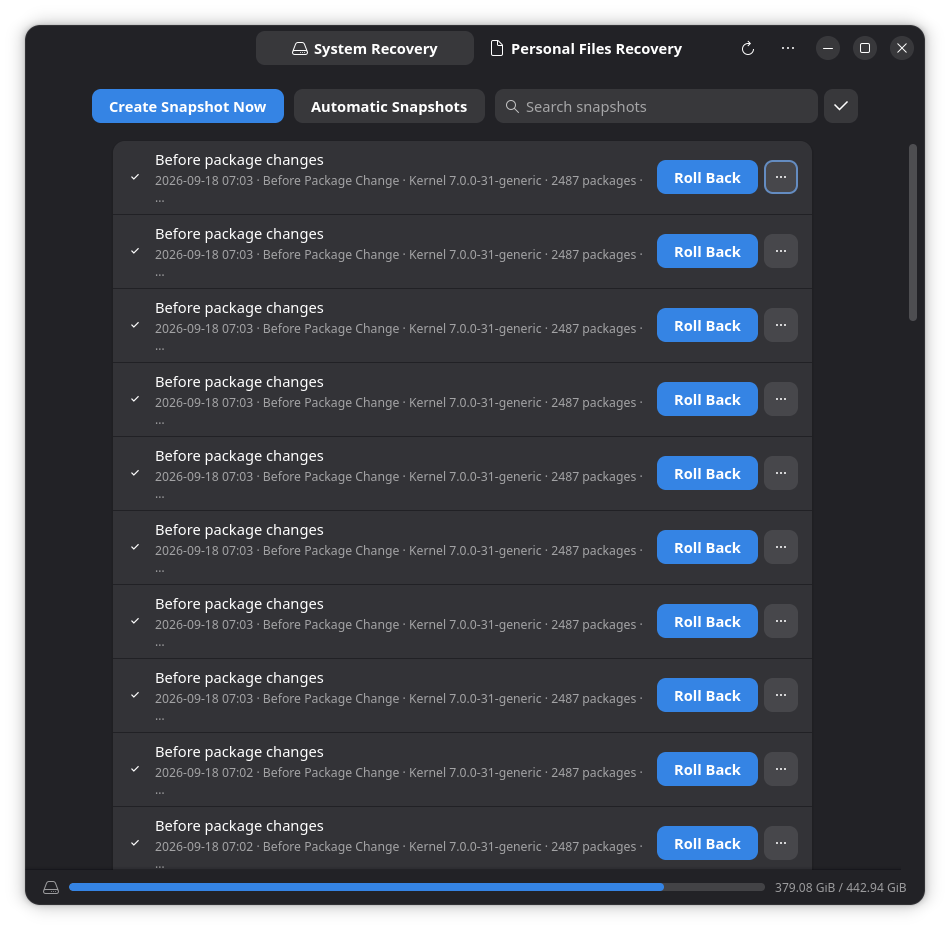

# Update failed, cannot boot or need to recover the desktop

## Confirm the version and symptom

Record the installed version and whether you were performing an ordinary package update or a [1.x migration](./Upgrade-and-Migrate.md). Preserve the first error. Check whether the update process is still running before attempting recovery.

## Simple checks

Keep power connected. If the desktop still works, check Internet access and free space with `df -h / /boot`. Close duplicate package-management windows and let an active update finish. Do not delete package-manager lock files to bypass another process.

If the desktop fails but a text console works, use the [terminal-mode guide](../Skills/System-Management/Terminal-Mode.md). If the OS cannot boot, use trusted Live media to inspect and back up files before changing disks.

## Collect diagnostic information

On the installed system, inspect:

```bash
sudo dpkg --audit
systemctl --failed
journalctl -b -p err
```

Package transaction history is in `/var/log/apt/history.log` and `/var/log/apt/term.log`. For a previous boot, `journalctl -b -1 -p err` works if that boot's journal was retained. A Live session's journal describes the Live system, not the installed system's previous failure.

## Choose the next step

### Interrupted package installation

Once no other package operation is running and adequate free space is available, finish pending configuration:

```bash
sudo dpkg --configure -a
sudo apt --fix-broken install
```

Review APT's proposed changes before accepting. Stop if it proposes unexpected removal of the desktop or important packages. After resolving the error, run `sudo apt update` and use the [normal update guide](./Update-Your-System.md). Do not force package removal to silence an unexplained dependency error.

For a repository signature, missing release or DNS error, fix that source or connection first. Do not disable signature verification or substitute an arbitrary Ubuntu codename.

### Cannot boot after an update

If GRUB offers **Advanced options**, try an older already-installed kernel and record whether it works. For a signed-driver failure, follow the [Secure Boot guide](./First-Boot-For-Secure-Boot.md). Do not run a generic `grub-install` command without establishing the boot mode, disk layout and signed boot requirements.

If a suitable snapshot exists, follow [Disk Snapshots Manager](../Applications/System/Disk-Snapshots-Manager/Disk-Snapshots-Manager.md). Availability depends on the filesystem and prior snapshot configuration. A local snapshot is not an independent backup, and rollback can discard changes within its scope.

{ width=633 }

In **System Recovery**, each row has a snapshot name, timestamp and **Roll Back** button. The example contains several entries named **Before package changes**; use their timestamps to find one from before the failure. **Search snapshots** can help narrow the list. The adjacent **Personal Files Recovery** tab serves a different recovery task. Read the linked recovery guide before choosing **Roll Back**.

### Desktop settings broken or want a factory reset

Use [display and desktop troubleshooting](./Troubleshoot-Displays-and-Desktop.md) to isolate the affected extension or user setting. AnduinOS 2 does not use the old `do-anduinos-autorepair` tool. An APT update does not reset user settings. Avoid blanket `dconf reset` operations; restore a known configuration or change the specific setting after backing it up.

## When to ask for help

Seek assistance before disk or bootloader changes if you cannot identify the installed root filesystem, encryption, or EFI partition. Provide the error, update type, boot mode, filesystem layout and whether recovery media can read your files. Use the [backup guide](./Backup-And-Restore.md) to preserve data first; do not format a partition to make it mountable.
