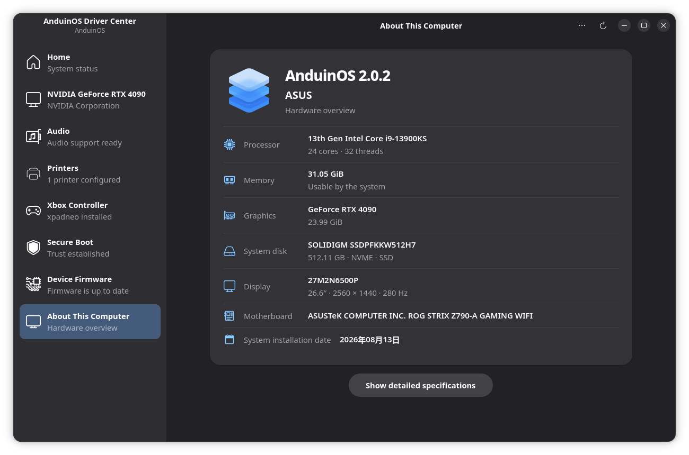

# Find help by symptom

Start with what fails, even if you do not know which driver or service is responsible.

| Symptom | Guide |
| --- | --- |
| Wi-Fi missing, Realtek adapter not detected, Bluetooth disconnects | [Network and Bluetooth](./Troubleshoot-Network-and-Bluetooth.md) |
| No sound, Dummy Output, microphone not working | [Sound and microphones](./Troubleshoot-Sound.md) |
| Black screen, external monitor freezes, wrong refresh rate, broken desktop | [Displays and desktop](./Troubleshoot-Displays-and-Desktop.md) |
| Printer paused or scanner not found | [Printing and scanning](./Troubleshoot-Printing-and-Scanning.md) |
| Update failed, computer will not boot, need to recover files | [Updates and recovery](./Troubleshoot-Updates-and-Recovery.md) |
| Forgot password or automatic login still prompts | [Accounts and passwords](./Accounts-and-Passwords.md) |
| Suspend fails or laptop will not wake | [Diagnose sleep](../Skills/System-Management/Diagnose-Sleep.md) |

## Record the environment before changing it

For a graphical overview, open **Driver Center** and select **About This Computer** at the bottom of the sidebar. Read the AnduinOS version at the top, then the **Processor**, **Memory** and **Graphics** rows.

{ width=840 }

This machine reports **AnduinOS 2.0.2**. Its hardware values are examples, not minimum requirements. **Memory** is labeled as usable by the system. The page also lists storage and display details, with **Show detailed specifications** at the bottom. The GNOME version is not shown in this view.

Run these read-only commands on the affected machine:

```bash
cat /etc/os-release
uname -r
```

Record the device model, exact symptom, when it started, and the last change made. If the problem only occurs after an update, record whether an older installed kernel or a Live USB behaves differently. A test from a Live USB has a different software version and configuration, so it narrows the problem without proving its cause.

## Ask for help with useful evidence

Use [AnduinOS community discussions](https://github.com/Anduin2017/AnduinOS/discussions) with your version, hardware model/device ID, exact error, reproduction steps, and relevant log excerpts from the time of failure. Include what you already tried and its result. Review logs for account names, network names, addresses and other private information before publishing. Never include passwords, private keys or recovery secrets.

Follow one change at a time and retest. Keep a backup before recovery operations. A full desktop reset, random driver installer or forced package removal can hide the original cause and create additional problems.
