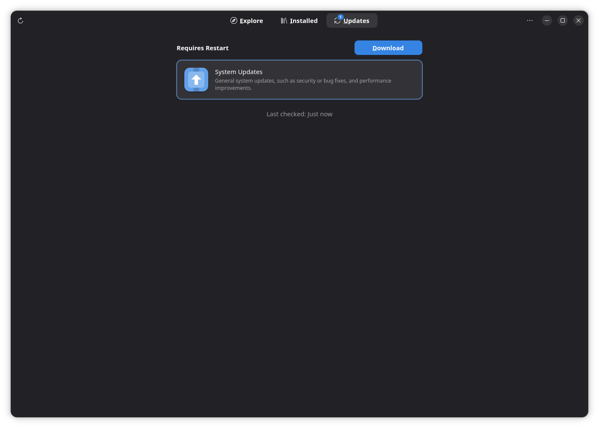
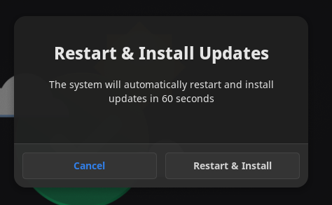

# Update your system

Keeping your system up-to-date is essential for receiving the latest security patches, bug fixes, and new features. AnduinOS is designed to make this process seamless, safe, and mostly automatic.

## Automatic Security Updates (Silent & Safe)

By default, AnduinOS is configured to protect you automatically. The system runs a background service (`unattended-upgrades`) that periodically checks for critical security patches.

If a severe security vulnerability is fixed in the upstream repositories, AnduinOS will automatically download and install the patch in the background while you work. You do not need to intervene, and you will not be interrupted by pop-ups for these essential fixes.

## Managing Updates via App Store (Recommended)

For regular feature updates and application upgrades, the safest and easiest method is using the built-in **App Store** (GNOME Software).

1. Open your application menu and launch **App Store**.
2. Navigate to the **Updates** tab.
3. Click **Download** if updates are available.
4. Once downloaded, click **Restart & Update**.



### Why "Restart & Update"? (Offline Updates)
You might wonder why the system needs to restart to apply updates. AnduinOS uses a modern mechanism called **Offline Updates**. 



If you update core libraries while applications (like your browser or the desktop itself) are running, those apps can instantly crash because the files they rely on were replaced underneath them. 
When you click "Restart & Update", the system reboots into a minimal, safe environment where no user apps are running. It applies the updates cleanly, and then automatically restarts back to your desktop. This ensures rock-solid system stability.

## (Alternative) Command Line Updates

If you are an advanced user or managing a server without a graphical interface, you can update your system using the standard `apt` package manager.

```bash title="Update your package list and upgrade"
sudo apt update
sudo apt upgrade
```

*Note: While `apt upgrade` is fast, be aware that updating graphical components while you are actively using them may cause temporary visual glitches or require you to log out and log back in to fully apply the changes.*
