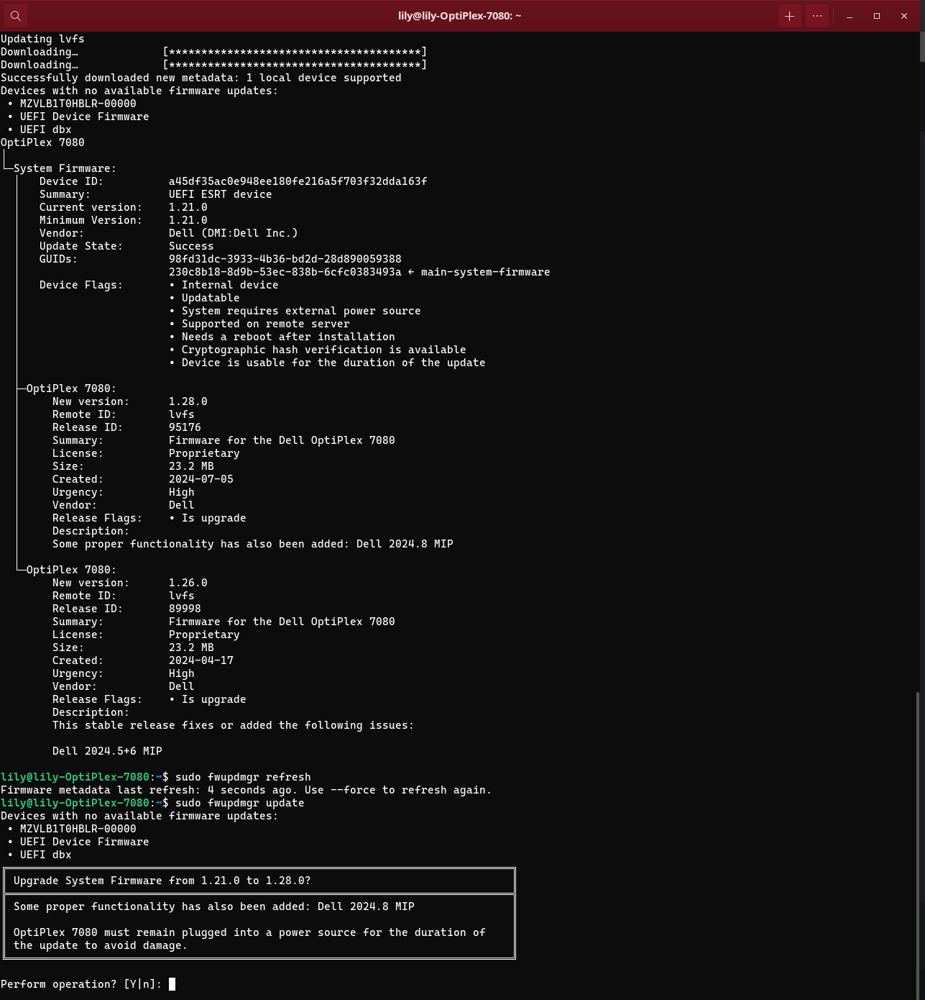

# Upgrade firmware

Keeping your hardware firmware (like your motherboard BIOS, SSD controllers, or peripheral devices) up-to-date is crucial for stability and security. 

AnduinOS comes with `fwupd` pre-installed—a daemon designed to work with the Linux Vendor Firmware Service (LVFS) to securely update device firmware from a wide range of hardware manufacturers (including Dell, Lenovo, HP, Logitech, etc.).

## (Recommended) Upgrade via App Store

You do not need to use the command line to check for firmware updates! AnduinOS integrates hardware firmware updates directly into the graphical interface.

1. Open your application menu and launch **App Store** (GNOME Software).
2. Navigate to the **Updates** tab.
3. When the App Store checks for updates, it automatically queries `fwupd` in the background.
4. If a firmware update for your device is available, it will appear here as a "System Update" or "Hardware Update".
5. Simply click **Download** and then **Restart & Update**. Your system will reboot and safely flash the new firmware before returning to the desktop.

---

## (Advanced) Upgrade via Command Line

For power users or headless setups, you can interact with the `fwupd` daemon directly using the `fwupdmgr` command-line tool.

1. **Refresh the firmware list:**
   ```bash title="Refresh firmware metadata"
   fwupdmgr refresh
   ```

2. **Check for available updates for your devices:**
   ```bash title="Check for updates"
   fwupdmgr get-updates
   ```

3. **Install the upgrades:**
   ```bash title="Upgrade firmware"
   fwupdmgr update
   ```
   *(Note: If a firmware update requires a reboot, the terminal will prompt you to restart your machine).*


